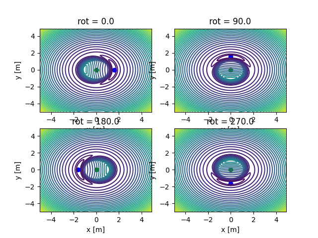
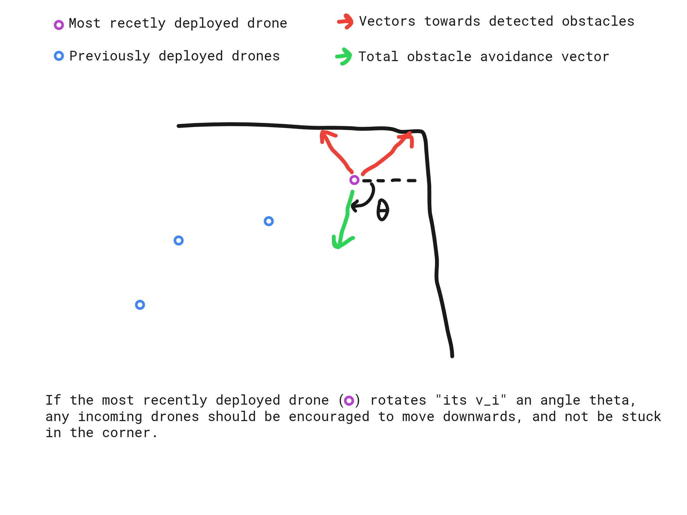

# Investigating the effect of $\mathbf{v}_{i}$

Setting initial value for $\mathbf{v}_{i}$ as $\begin{bmatrix}1 & 0\end{bmatrix}^{T}$
and rotating clockwise by angle $\theta = 0, 90, 180, 270$ degrees yields the potential fields
shown below. The base station is shown in green, and the point of minimum potential is shown
as a blue dot. It is clear for the plot that the point of minimum potential is simply rotated
about the base station by $\theta$.

# Idea for exploring after encountering obstacles

