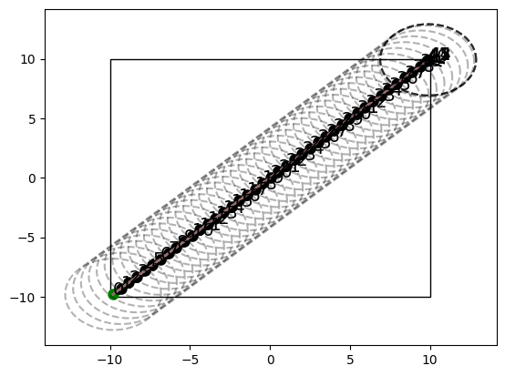

## 1D Line deploy
### Potential field affecting drone $\nu_{n+1}$
$$
U_{n+1} = \frac{1}{2}\sum_{i=1}^{n}\kappa_{i}||x_{n+1}-x_{i}-\xi_{n+1,i}||^{2}
$$
### Force field affecting drone $\nu_{n+1}$
$$
\begin{aligned}
F_{n+1} &= -\frac{\partial}{\partial x_{n+1}}U_{n+1} = -\frac{1}{2}\sum_{i=1}^{n}\kappa_{i}\frac{\partial}{\partial x_{n+1}}||x_{n+1}-x_{i}-\xi_{n+1,i}||^{2}\\
&=-\frac{1}{2}\sum_{i=1}^{n}\kappa_{i}\frac{\partial}{\partial x_{n+1}}(x_{n+1}-x_{i}-\xi_{n+1,i})^{2}\\
&=-\frac{1}{2}\sum_{i=1}^{n}\kappa_{i}2(x_{n+1}-x_{i}-\xi_{n+1,i})\frac{\partial}{\partial x_{n+1}}(x_{n+1}-x_{i}-\xi_{n+1,i})\\
&=-\sum_{i=1}^{n}\kappa_{i}(x_{n+1}-x_{i}-\xi_{n+1,i})\\
&=\sum_{i=1}^{n}\kappa_{i}(x_{i}-x_{n+1}+\xi_{n+1,i})\\
\end{aligned}
$$

### Equilibrium point for drone $\nu_{n+1}$
$$
\begin{aligned}
  x_{n+1} = x_{n+1}^{*}&\iff F_{n+1} = 0\\
  &\iff  =\sum_{i=1}^{n}\kappa_{i}(x_{i}-x_{n+1}^{*}+\xi_{n+1,i})=0\\
  &\iff -x_{n+1}^{*}\sum_{i=1}^{n}\kappa_{i} + \sum_{i=1}^{n}\kappa_{i}(x_{i}+\xi_{n+1, i}) = 0\\
  &\iff x_{n+1}^{*} = \frac{\sum_{i=1}^{n}\kappa_{i}(x_{i}+\xi_{n+1, i})}{\sum_{i=1}^{n}\kappa_{i}}\\
\end{aligned}
$$
It is assumed that $\sum_{i=1}^{n}\kappa_{i} \neq 0$.
### Checking if $x_{n}^{*} < x_{n+1}^{*}$
We assume that all drones $\nu_{m}, m\leq n$ are static and placed at equilibriums so that $x_{m}^{*} < x_{m+1}^{*}\;\forall\;m<n$.
Now:
$$
\begin{aligned}
  x_{n}^{*} < x_{n+1}^{*}&\iff x_{n}^{*}<\frac{\sum_{i=1}^{n}\kappa_{i}(x_{i}^{*}+\xi_{n+1, i})}{\sum_{i=1}^{n}\kappa_{i}}\\
  &\iff x_{n}^{*}\sum_{i=1}^{n}\kappa_{i}<\sum_{i=1}^{n}\kappa_{i}(x_{i}^{*}+\xi_{n+1, i})\\
  &\iff x_{n}^{*}\sum_{i=1}^{n}\kappa_{i}-\sum_{i=1}^{n}\kappa_{i}x_{i}^{*}<\sum_{i=1}^{n}\kappa_{i}\xi_{n+1, i}\\
  &\iff \sum_{i=1}^{n}\kappa_{i}(x_{n}^{*}-x_{i}^{*})<\sum_{i=1}^{n}\kappa_{i}\xi_{n+1, i}\\
\end{aligned}
$$
In the left sum, the term $\kappa_{n}(x_{n}^{*}-x_{n}^{*}) = 0$, thus:
$$
\begin{aligned}
  x_{n}^{*} < x_{n+1}^{*}&\iff \sum_{i=1}^{n-1}\kappa_{i}(x_{n}^{*}-x_{i}^{*})<\sum_{i=1}^{n}\kappa_{i}\xi_{n+1, i}\\
\end{aligned}
$$
Seen as $x_{m}^{*} < x_{m+1}^{*}\;\forall\;m<n$, we know that $x_{m-i}^{*} < x_{m+1}^{*}\;\forall\;m<n, 0\leq i<m$. Thus we know that $x_{m+1}^{*} - x_{m-i}^{*} > 0\;\forall\;m<n, 0\leq i<m$. If we further assume that $\kappa_{i} \geq 0\;\forall\;0<i<n$, we have that:
$$
\begin{aligned}
 \sum_{i=1}^{n-1}\kappa_{i}(x_{n}^{*}-x_{i}^{*})\geq 0\\
\end{aligned}
$$
Thus:
$$
\begin{aligned}
  x_{n}^{*} < x_{n+1}^{*}&\iff 0\leq\sum_{i=1}^{n-1}\kappa_{i}(x_{n}^{*}-x_{i}^{*})<\sum_{i=1}^{n}\kappa_{i}\xi_{n+1, i}\\
  &\iff 0<\sum_{i=1}^{n}\kappa_{i}\xi_{n+1, i}\\
\end{aligned}
$$
$\xi_{n+1, i}\geq0 \;\forall\;0<i\leq n$ by design.
If we choose $\kappa_{i}\geq 0\;\forall\;0<i\leq n$ we have:

$$
\;\exist\;0<i\leq n:\kappa_{i} > 0, \xi_{n+1, i}>0\iff x_{n}^{*} < x_{n+1}^{*}
$$

> **Assumptions summary**
> 
> $\sum_{i=1}^{n}\kappa_{i} \neq 0$
>
>$\kappa_{i} \geq 0\;\forall\;0<i<n\implies\sum_{i=1}^{n-1}\kappa_{i} \geq 0$
>
>Thus
>
> $\sum_{i=1}^{n-1}\kappa_{i} = 0 \implies\sum_{i=1}^{n}\kappa_{i} = \kappa_{n}\neq 0$
>
> $\sum_{i=1}^{n-1}\kappa_{i} = \sum_{i=1}^{n-1}\kappa_{i}> 0 \implies\sum_{i=1}^{n}\kappa_{i} = \kappa_{n} + \sum_{i=1}^{n-1}\kappa_{i}\neq 0 \implies \kappa_{n}\neq-\sum_{i=1}^{n-1}\kappa_{i}$

## Extending to only local knowledge

### Neighbors of $\nu_{n+1}$
The set of all drones such that the $RSSI$ from those drones to $\nu_{n+1}$ is above a given threshold:
$$
\mathcal{N}(n+1) = \{1\leq i \leq n: \xi_{n+1, i} \geq \tau > 0\}
$$
### Potential field affecting drone $\nu_{n+1}$
$$
U_{n+1} = \frac{1}{2}\sum_{i\in\mathcal{N}(n+1)}\kappa_{i}||x_{n+1}-x_{i}-\xi_{n+1,i}||^{2}
$$

### Force field affecting drone $\nu_{n+1}$
$$
F_{n+1} = \sum_{i\in\mathcal{N}(n+1)}\kappa_{i}(x_{i}-x_{n+1}+\xi_{n+1,i})
$$
### Equilibrium point for drone $\nu_{n+1}$
$$
  x_{n+1}^{*} = \frac{\sum_{i\in\mathcal{N}(n+1)}\kappa_{i}(x_{i}+\xi_{n+1, i})}{\sum_{i\in\mathcal{N}(n+1)}\kappa_{i}}\\
$$
### Checking if $\nu_{i}$ moves further than it's neighbors
Proove that:
$$
x_{n+1}^{*} > \max_{i\in\mathcal{N}(n+1)}x_{i}
$$

Define: $j = \argmax\limits_{i\in\mathcal{N}(n+1)}x_{i}$

$$
\begin{aligned}
  \max_{i\in\mathcal{N}(n+1)}x_{i}= x_{j} < x_{n+1}^{*}&\iff x_{j} < \frac{\sum_{i\in\mathcal{N}(n+1)}\kappa_{i}(x_{i}+\xi_{n+1, i})}{\sum_{i\in\mathcal{N}(n+1)}\kappa_{i}}\\
  &\iff x_{j}\sum_{i\in\mathcal{N}(n+1)}\kappa_{i} < \sum_{i\in\mathcal{N}(n+1)}\kappa_{i}(x_{i}+\xi_{n+1, i})\\
  &\iff x_{j}\sum_{i\in\mathcal{N}(n+1)}\kappa_{i} - \sum_{i\in\mathcal{N}(n+1)}\kappa_{i}x_{i} < \sum_{i\in\mathcal{N}(n+1)}\kappa_{i}\xi_{n+1, i}\\
  &\iff \sum_{i\in\mathcal{N}(n+1)}\kappa_{i}(x_{j} - x_{i}) < \sum_{i\in\mathcal{N}(n+1)}\kappa_{i}\xi_{n+1, i}\\
  &\iff \sum_{i\in\mathcal{N}(n+1)\setminus\{j\}}\kappa_{i}(x_{j} - x_{i}) < \sum_{i\in\mathcal{N}(n+1)}\kappa_{i}\xi_{n+1, i}\\
\end{aligned}
$$
We know that $x_{j} \geq x_{i}\;\forall\;i\in\mathcal{N}(n+1)\setminus\{j\}$ such that $x_{j} - x_{i} \geq 0\;\forall\;i\in\mathcal{N}(n+1)\setminus\{j\}$. Furthermore $\kappa_{i}\geq 0\;\forall\;1\leq i\leq n+1$. Thus:
$$
\sum_{i\in\mathcal{N}(n+1)\setminus\{j\}}\kappa_{i}(x_{j} - x_{i})\geq 0
$$
Inserting yields:
$$
\begin{aligned}
  \max_{i\in\mathcal{N}(n+1)}x_{i}= x_{j} < x_{n+1}^{*}&\iff 0 \leq\sum_{i\in\mathcal{N}(n+1)\setminus\{j\}}\kappa_{i}(x_{j} - x_{i}) < \sum_{i\in\mathcal{N}(n+1)}\kappa_{i}\xi_{n+1, i}\\
  &\iff 0 < \sum_{i\in\mathcal{N}(n+1)}\kappa_{i}\xi_{n+1, i}
  
\end{aligned}
$$
By definition $\xi_{n+1, i} \geq \tau > 0\;\forall\;i\in\mathcal{N}(n+1)$. Thus:
$$
\sum_{i\in\mathcal{N}(n+1)}\kappa_{i}\xi_{n+1, i} \geq \sum_{i\in\mathcal{N}(n+1)}\kappa_{i}\tau\geq 0
$$
The inequality above holds strictly iff. $\exists\;i\in\mathcal{N}(n+1):\;\kappa_{i} > 0$. Thus:
$$
\exists\;i\in\mathcal{N}(n+1):\;\kappa_{i} > 0 \iff \sum_{i\in\mathcal{N}(n+1)}\kappa_{i}\xi_{n+1, i} > 0 \iff x_{n+1}^{*} > \max_{i\in\mathcal{N}(n+1)}x_{i}
$$
Thus we know that $\nu_{n+1}$ will move beyond it's neighbor, $\nu_{j}$, that is furthest away from the origin.

### Checking if $\nu_{n+1}$ moves further than the previously deployed drone
**TODO**: Check that there is a "chain" from $\nu_{1}$ to $\nu_{n}$ such that, in the end, $n\in\mathcal{N}(n+1)$. This means that previous drones must not
land too far apart, i.e. $\exists\;j\in\mathcal{N}(i): x_{j}\geq x_{i}\;\forall\;1\leq i < n$.
Alternatively: $\exists\;j\in\mathcal{N}(n+1): x_{j}\geq x_{n+1}\;\forall\;x_{1}\leq x_{n+1} \leq x_{n}$.

By definition $\mathcal{N}(n+1) = \emptyset \implies F_{n+1} = 0$. With integrator dynamics on the drone: $\dot{x}_{n+1} = F_{n+1}$, this means that
the drone will stop moving whenever it's neighbor set is empty, i.e. $\xi_{n+1, i} < \tau\;\forall\;1\leq i\leq n$.

## Extending to 2D

A drone , $\nu_{n}$ now has state $\mathbf{x}_{n} = \begin{bmatrix}x_{n}&y_{n}\end{bmatrix}^{T}\in\mathbb{R}^{2}$. The RSSI is still just a scalar variable.
Due to thus the potential field for drone $n+1$ is modified:
### Potential field for drone $\nu_{i+1}$
$$
U_{n+1} = \frac{1}{2}\sum_{i=1}^{n}\kappa_{i}||\mathbf{x}_{n+1}-\mathbf{x}_{i}-\mathbf{1}_{2\times1}\xi_{n+1,i}||^{2}
$$

### Force field affecting drone $\nu_{n+1}$
$$
\begin{aligned}
\mathbf{F}_{n+1} &= -\frac{\partial}{\partial \mathbf{x}_{n+1}}U_{n+1} = -\frac{1}{2}\sum_{i=1}^{n}\kappa_{i}\frac{\partial}{\partial \mathbf{x}_{n+1}}||\mathbf{x}_{n+1}-\mathbf{x}_{i}-\mathbf{1}_{2\times1}\xi_{n+1,i}||^{2}\\
&=-\sum_{i=1}^{n}\kappa_{i}(\mathbf{x}_{n+1}-\mathbf{x}_{i}-\mathbf{1}_{2\times1}\xi_{n+1,i})\\
&=\sum_{i=1}^{n}\kappa_{i}(\mathbf{x}_{i}-\mathbf{x}_{n+1}+\mathbf{1}_{2\times1}\xi_{n+1,i})\\
\end{aligned}
$$

### Equilibrium point for drone $\nu_{n+1}$
> **Note to self**
>
> Check the possibility of modelling the RSSI as a decaying function of $||\mathbf{x}_{n+1} - \mathbf{x}_{i}||$ and include this in the proof.
$$
\begin{aligned}
  \mathbf{x}_{n+1} = \mathbf{x}_{n+1}^{*}&\iff \mathbf{F}_{n+1} = \mathbf{0}\\
  &\iff  =\sum_{i=1}^{n}\kappa_{i}(\mathbf{x}_{i}-\mathbf{x}_{n+1}^{*}+\mathbf{1}_{2\times1}\xi_{n+1,i})=\mathbf{0}\\
  &\iff -\mathbf{x}_{n+1}^{*}\sum_{i=1}^{n}\kappa_{i} + \sum_{i=1}^{n}\kappa_{i}(\mathbf{x}_{i}+\mathbf{1}_{2\times1}\xi_{n+1,i})=\mathbf{0}\\
  &\iff \mathbf{x}_{n+1}^{*} = \frac{\sum_{i=1}^{n}\kappa_{i}(\mathbf{x}_{i}+\mathbf{1}_{2\times1}\xi_{n+1,i})}{\sum_{i=1}^{n}\kappa_{i}}\\
\end{aligned}
$$

### Checking if $||\mathbf{x}_{n}^{*}|| < ||\mathbf{x}_{n+1}^{*}||$

We assume that all drones $\nu_{m}, m\leq n$ are static and placed at equilibriums so that $||\mathbf{x}_{m}^{*}|| < ||\mathbf{x}_{m+1}^{*}||\;\forall\;m<n$.
Now:
$$
\begin{aligned}
||\mathbf{x}_{n}^{*}|| < ||\mathbf{x}_{n+1}^{*}||&\iff||\mathbf{x}_{n}^{*}|| < \Bigg|\Bigg|\frac{\sum_{i=1}^{n}\kappa_{i}(\mathbf{x}_{i}+\mathbf{1}_{2\times1}\xi_{n+1,i})}{\sum_{i=1}^{n}\kappa_{i}}\Bigg|\Bigg|\\
&\iff||\mathbf{x}_{n}^{*}||\Big|\Big|\sum_{i=1}^{n}\kappa_{i}\Big|\Big| = ||\mathbf{x}_{n}^{*}||\Big|\sum_{i=1}^{n}\kappa_{i}\Big| < \Big|\Big|\sum_{i=1}^{n}\kappa_{i}(\mathbf{x}_{i}+\mathbf{1}_{2\times1}\xi_{n+1,i})\Big|\Big|\\
&\iff||\mathbf{x}_{n}^{*}||\Big|\sum_{i=1}^{n}\kappa_{i}\Big| < \Big|\Big|\sum_{i=1}^{n}\kappa_{i}(\mathbf{x}_{i}+\mathbf{1}_{2\times1}\xi_{n+1,i})\Big|\Big|\leq \Big|\Big|\sum_{i=1}^{n}\kappa_{i}\mathbf{x}_{i}\Big|\Big|+\Big|\Big|\sum_{i=1}^{n}\kappa_{i}\mathbf{1}_{2\times1}\xi_{n+1,i}\Big|\Big|\\
&\iff||\mathbf{x}_{n}^{*}||\Big|\sum_{i=1}^{n}\kappa_{i}\Big| - \Big|\Big|\sum_{i=1}^{n}\kappa_{i}\mathbf{x}_{i}\Big|\Big| < \Big|\Big|\sum_{i=1}^{n}\kappa_{i}\mathbf{1}_{2\times1}\xi_{n+1,i}\Big|\Big|\\
&\iff||\mathbf{x}_{n}^{*}||\Big|\sum_{i=1}^{n}\kappa_{i}\Big| - \sum_{i=1}^{n}|\kappa_{i}|\cdot||\mathbf{x}_{i}|| \leq \Big|\Big|\sum_{i=1}^{n}\kappa_{i}\mathbf{x}_{n}^{*}\Big|\Big| - \Big|\Big|\sum_{i=1}^{n}\kappa_{i}\mathbf{x}_{i}\Big|\Big| < \Big|\Big|\sum_{i=1}^{n}\kappa_{i}\mathbf{1}_{2\times1}\xi_{n+1,i}\Big|\Big|\\
\end{aligned}
$$
Now if we choose $\kappa_{i}\geq0\;\forall\;0<i\leq n$ we have $|\kappa_{i}| = \kappa_{i}\;\forall\;0<i\leq n$ and thus:
$$
\Big|\sum_{i=1}^{n}\kappa_{i}\Big| = \sum_{i=1}^{n}|\kappa_{i}| = \sum_{i=1}^{n}\kappa_{i}
$$
This gives:
$$
\begin{aligned}
||\mathbf{x}_{n}^{*}|| < ||\mathbf{x}_{n+1}^{*}||&\iff||\mathbf{x}_{n}^{*}||\sum_{i=1}^{n}\kappa_{i} - \sum_{i=1}^{n}\kappa_{i}||\mathbf{x}_{i}|| \leq \Big|\Big|\sum_{i=1}^{n}\kappa_{i}\mathbf{x}_{n}^{*}\Big|\Big| - \Big|\Big|\sum_{i=1}^{n}\kappa_{i}\mathbf{x}_{i}\Big|\Big| < \Big|\Big|\sum_{i=1}^{n}\kappa_{i}\mathbf{1}_{2\times1}\xi_{n+1,i}\Big|\Big|\\
&\iff\sum_{i=1}^{n-1}\kappa_{i}\big(||\mathbf{x}_{n}^{*}|| - ||\mathbf{x}_{i}^{*}||) < \Big|\Big|\sum_{i=1}^{n}\kappa_{i}\mathbf{1}_{2\times1}\xi_{n+1,i}\Big|\Big|\\
\end{aligned}
$$
As stated before we know that $||\mathbf{x}_{m}^{*}|| < ||\mathbf{x}_{m+1}^{*}||\;\forall\;m<n$. Thus $||\mathbf{x}_{m+1}^{*}|| - ||\mathbf{x}_{m-i}^{*}|| > 0\;\forall\;m<n,0<i<n$. Using the we have:
$$
\begin{aligned}
||\mathbf{x}_{n}^{*}|| < ||\mathbf{x}_{n+1}^{*}||&\iff0\leq\sum_{i=1}^{n-1}\kappa_{i}\big(||\mathbf{x}_{n}^{*}|| - ||\mathbf{x}_{i}^{*}||) < \Big|\Big|\sum_{i=1}^{n}\kappa_{i}\mathbf{1}_{2\times1}\xi_{n+1,i}\Big|\Big|\\
&\iff0 < \Big|\Big|\sum_{i=1}^{n}\kappa_{i}\mathbf{1}_{2\times1}\xi_{n+1,i}\Big|\Big| = \sum_{i=1}^{n}|\kappa_{i}|\cdot||\mathbf{1}_{2\times1}||\cdot|\xi_{n+1,i}| = \sqrt{2}\sum_{i=1}^{n}\kappa_{i}\xi_{n+1,i} \\
&\iff0<\sum_{i=1}^{n}\kappa_{i}\xi_{n+1,i}
\end{aligned}
$$

$\xi_{n+1, i}\geq0 \;\forall\;0<i\leq n$ by design.
If we choose $\kappa_{i}\geq 0\;\forall\;0<i\leq n$ we have:

$$
\;\exist\;0<i\leq n:\kappa_{i} > 0, \xi_{n+1, i}>0\iff ||\mathbf{x}_{n}^{*}|| < ||\mathbf{x}_{n+1}^{*}||
$$

## Adding obstacke avoidance
Each drone, $\nu_{i}$, is equipped with 4 range sensors, $r_{j},\;j\in[0,4)$. Sensor $r_{j}$ is mounted on the body at an angle $\theta_{j} = 90^{\circ}\cdot j$. The range sensors can maximally detect objects at a distance $d_{max}$ away. 
Given the description of an obstacle $\mathcal{O}=\{\mathbf{x}^{n}: f(\mathbf{x}^{n})\leq 0\}$ in the inertial frame such that the border of the obstacle is described by $\partial\mathcal{O} = \{\mathbf{x}^{n}: f(\mathbf{x}^{n}) = 0\}$ and a drone positioned at $\mathbf{x}_{i}^{n}$ in the inertial frame with a yaw angle $\psi_{i}$. The set 
$$\mathcal{R}_{j} = \{d: f\big(\mathbf{x}_{i}^{n} + \mathbf{R}_{z}(\psi_{i})\mathbf{R}_{z}(\theta_{j})\begin{bmatrix}
    d& 0
\end{bmatrix}^{T}\big) = 0, 0\leq d\leq d_{max}\}$$
Is the set of all points along the sensor $r_{j}$'s x-axis that intersects with the boundary of the obstacle $\mathcal{O}$. When polling a range sensor, it returns measurements according to:
$$
\mathbf{m}_{j}^{s} = \begin{cases}
    \begin{bmatrix}
        \min\mathcal{R}_{j}&0
    \end{bmatrix}^{T}, &\mathcal{R}_{j}\neq\emptyset\\
    \begin{bmatrix}
        \infty&0
    \end{bmatrix}^{T}, &\text{otherwise}
\end{cases}
$$
In the inertial frame the distance is computed as:
$$
\mathbf{m}_{j}^{n} =  \mathbf{R}_{z}(\psi_{i})\mathbf{R}_{z}(\theta_{j})\mathbf{m}_{j}^{s}
$$
The force exerted on a drone by obstacles is defined as:
$$
\mathbf{F}_{o}=-k_{o}\sum_{j:\mathcal{R}_{j}\neq\emptyset,\;0\leq j< 4}
   \frac{\mathbf{m}_{j}^{n}}{||\mathbf{m}_{j}^{n}||^{3}}
$$

With obstacle avoidance, the total force exerted on a drone, $\nu_{n+1}$, is:

$$
\mathbf{F}_{tot, n+1} = \mathbf{F}_{n+1} + \mathbf{F}_{o} = \sum_{i=1}^{n}\kappa_{i}(\mathbf{x}_{i}-\mathbf{x}_{n+1}+\mathbf{1}_{2\times1}\xi_{n+1,i})-k_{o}\sum_{j:\mathcal{R}_{j}\neq\emptyset,\;0\leq j< 4}
   \frac{\mathbf{m}_{j}^{n}}{||\mathbf{m}_{j}^{n}||^{3}}
$$

## Observation
In the 1D-case spread is generated by assuring that the distance from the previously deployed drone,
$\nu_{n}$, to the currently deploying drone, $\nu_{n+1}$, is larger than zero. This in turn means that the distance from the base station, $\nu_{1}$, to the currently deploying drone, $\nu_{n+1}$, is larger than from the base station to the previously deployed drone, $\nu_{n}$, which in turn results in the new drones exploring unexplored areas.

In the 2D-case, distance from the base station, $\nu_{1}$, is not a satisfying metric for spread. Ensuring that $\nu_{n+1}$ is further away from the base station than $\nu_{n}$ does indeed ensure that unexplored areas are explored. As seen in the figure below, the drones align themselves on a straight line in the order in which they are deployed. The last few drones cluster together as they encounter a wall, even though a larger area would be explored if they moved away from the line. Due to this another potential field have to be created for the 2D-case. This field must be a valid representation of dispersion in the 2D-case.

## Alternative metric for 2D spread: Distance from centroid

### Potential field affecting $\nu_{n+1}$

$$
U_{n+1} = \frac{1}{2}||\mathbf{x}_{n+1} - \sum_{i=1}^{n}\xi_{n+1, i}\mathbf{x}_{i}||^{2}
$$

### Force affecting $\nu_{n+1}$

$$
\begin{aligned}
  \mathbf{F}_{n+1} = \frac{\partial}{\partial\mathbf{x}_{n+1}}U_{n+1} = -\Big(\mathbf{I} - \sum_{i=1}^{n}\frac{\partial\xi_{n+1, i}}{\partial\mathbf{x}_{n+1}}\mathbf{x}_{i}\Big)\Big(\mathbf{x}_{n+1} - \sum_{i=1}^{n}\xi_{n+1, i}\mathbf{x}_{i}\Big)
\end{aligned}
$$
$\xi_{n+1, i}$ is modelled as a decaying function of the distance between $\nu_{n+1}$ and $\nu_{i}$. Thus $\xi_{n+1, i} = f(||\mathbf{x}_{n+1} - \mathbf{x}_{i}||)$ and:
$$
\frac{\partial\xi_{n+1, i}}{\partial\mathbf{x}_{n+1}} = \frac{\partial f(||\mathbf{x}_{n+1} - \mathbf{x}_{i}||)}{\partial||\mathbf{x}_{n+1} - \mathbf{x}_{i}||}\cdot\frac{\partial||\mathbf{x}_{n+1} - \mathbf{x}_{i}||}{\partial\mathbf{x}_{n+1}} = \frac{\partial f(||\mathbf{x}_{n+1} - \mathbf{x}_{i}||)}{\partial||\mathbf{x}_{n+1} - \mathbf{x}_{i}||}\frac{\mathbf{x}_{n+1} - \mathbf{x}_{i}}{||\mathbf{x}_{n+1} - \mathbf{x}_{i}||}
$$

### Example
 
 $\xi_{n+1, i} = \exp{(-||\mathbf{x}_{n+1}-\mathbf{x}_{i}||)}\implies\frac{\partial\xi_{n+1, i}}{\partial\mathbf{x}_{n+1}} = -\exp{(-||\mathbf{x}_{n+1}-\mathbf{x}_{i}||)}\frac{\mathbf{x_{n+1} - \mathbf{x}_{i}}}{||\mathbf{x}_{n+1} -\mathbf{x}_{i}||}$

 The force on $\nu_{n+1}$ is then:

$$
\mathbf{F}_{n+1} = -\frac{\partial}{\partial\mathbf{x}_{n+1}}U_{n+1} = -\Big(\mathbf{I} + \sum_{i=1}^{n}\frac{\exp{(-||\mathbf{x}_{n+1}-\mathbf{x}_{i}||)}}{||\mathbf{x}_{n+1} - \mathbf{x}_{i}||}\text{diag}(\mathbf{x_{n+1} - \mathbf{x}_{i}})\mathbf{x}_{i}\Big)\Big(\mathbf{x}_{n+1} - \sum_{i=1}^{n}\exp{(-||\mathbf{x}_{n+1}-\mathbf{x}_{i}||)}\mathbf{x}_{i}\Big)
$$

### Equilibrium for $\nu_{n+1}$ (not modelling $RSSI$)
$$
\mathbf{x}_{n+1}^{*} = \sum_{i=1}^{n}\xi_{n+1, i}\mathbf{x}_{i}
$$

## Alternative metric for 2D spread: Determinant of covariance matrix

### Potential field affecting $\nu_{n+1}$
#### Sample covar. matrix
For $N$ samples with values $\mathbf{x}_{i},\;1\leq i\leq N$ the sample covariance matrix, $\mathbf{Q}$ is computed as:
$$
\mathbf{Q} = \frac{1}{N-1}\sum_{i=1}^{N}(\mathbf{x}_{i}-\bar{\mathbf{x}}_{N})(\mathbf{x}_{i}-\bar{\mathbf{x}}_{N})^{T},
$$
where
$$
\bar{\mathbf{x}}_{N} = \frac{1}{N}\sum_{i=1}^{N}\mathbf{x}_{i}
$$
#### Covariance matrix for $\nu_{n+1}$
$$
\begin{aligned}
\mathbf{Q}_{n+1} &= \frac{1}{(n+1)-1}\sum_{i=1}^{n+1}(\mathbf{x}_{i}-\bar{\mathbf{x}}_{n+1})(\mathbf{x}_{i}-\bar{\mathbf{x}}_{n+1})^{T}\\
&= \frac{1}{n}\sum_{i=1}^{n+1}\begin{bmatrix}
  x_{i}-\bar{x}_{n+1}\\y_{i}-\bar{y}_{n+1}
\end{bmatrix}\begin{bmatrix}
  x_{i}-\bar{x}_{n+1}&y_{i}-\bar{y}_{n+1}
\end{bmatrix}\\
&= \frac{1}{n}\sum_{i=1}^{n+1}\begin{bmatrix}
  (x_{i}-\bar{x}_{n+1})^{2} & (x_{i}-\bar{x}_{n+1})(y_{i}-\bar{y}_{n+1})\\
  \dots & (y_{i}-\bar{y}_{n+1})^{2}
\end{bmatrix}\\
\end{aligned}
$$
#### "The larger $|\mathbf{Q}|$ is, the more the datapoints are dispersed"
$$
\begin{aligned}
\det(\mathbf{Q}_{n+1}) &= \det\Bigg(\frac{1}{n}\sum_{i=1}^{n+1}\begin{bmatrix}
  (x_{i}-\bar{x}_{n+1})^{2} & (x_{i}-\bar{x}_{n+1})(y_{i}-\bar{y}_{n+1})\\
  \dots & (y_{i}-\bar{y}_{n+1})^{2}
\end{bmatrix}\Bigg)\\
&= \frac{1}{n^{2}}\det\Bigg(\begin{bmatrix}
  \sum_{i=1}^{n+1}(x_{i}-\bar{x}_{n+1})^{2} & \sum_{i=1}^{n+1}(x_{i}-\bar{x}_{n+1})(y_{i}-\bar{y}_{n+1})\\
  \dots & \sum_{i=1}^{n+1}(y_{i}-\bar{y}_{n+1})^{2}
\end{bmatrix}\Bigg)\\
&= \frac{1}{n^{2}}\Bigg[\Big(\sum_{i=1}^{n+1}(x_{i}-\bar{x}_{n+1})^{2}\Big)\Big(\sum_{i=1}^{n+1}(y_{i}-\bar{y}_{n+1})^{2}\Big)-\Big(\sum_{i=1}^{n+1}(x_{i}-\bar{x}_{n+1})(y_{i}-\bar{y}_{n+1})\Big)^{2}\Bigg]\\
\end{aligned}
$$

### Potential field affecting $\nu_{n+1}$
$$
\begin{aligned}
U_{n+1} &= \frac{n^{2}(n+1)}{2}\det(\mathbf{Q}_{n+1})\\
&=\frac{(n+1)}{2}\Bigg[\Big(\sum_{i=1}^{n+1}(x_{i}-\bar{x}_{n+1})^{2}\Big)\Big(\sum_{i=1}^{n+1}(y_{i}-\bar{y}_{n+1})^{2}\Big)-\Big(\sum_{i=1}^{n+1}(x_{i}-\bar{x}_{n+1})(y_{i}-\bar{y}_{n+1})\Big)^{2}\Bigg]
  
\end{aligned}
$$
### Force affecting $\nu_{n+1}$
$$
\begin{aligned}
  \frac{\partial}{\partial x_{n+1}}\bar{x}_{n+1} = \frac{\partial}{\partial x_{n+1}}\frac{1}{n+1}\sum_{i=1}^{n+1}x_{i} = \frac{1}{n+1}\frac{\partial}{\partial x_{n+1}}\sum_{i=1}^{n+1}x_{i} = \frac{1}{n+1}
\end{aligned}
$$
$$
\begin{aligned}
  \frac{\partial}{\partial x_{n+1}}\sum_{i=1}^{n+1}(x_{i}-\bar{x}_{n+1})^{2} &= \frac{\partial}{\partial x_{n+1}}(x_{n+1}-\bar{x}_{n+1})^{2} + \frac{\partial}{\partial x_{n}}\sum_{i=1}^{n+1}(x_{i}-\bar{x}_{n+1})^{2}
\end{aligned}
$$
