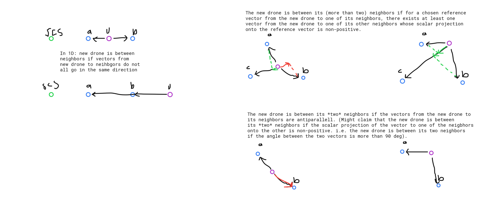

# Qualitative properties of $\xi$

$$
\begin{aligned}
  &\xi_{n+1, i} = f(||x_{n+1} - x_{i}||, \dots) =  f(d_{n+1, i}, \dots)\\
  &0 \leq \xi_{n+1, i} \leq \bar{\xi} \; \forall \; 1 \leq i \leq n\\

  &\frac{\partial}{\partial d_{n+1, i}} f(d_{n+1, i}, \dots) \leq 0\\
  &\frac{\partial}{\partial x_{n+1}} \xi_{n+1, i} = \frac{\partial}{\partial d_{n+1, i}} f(d_{n+1, i}, \dots)\cdot\frac{\partial}{\partial x_{n+1}}d_{n+1, i}
  = \frac{\partial}{\partial d_{n+1, i}} f(d_{n+1, i}, \dots)\cdot\text{sign}(x_{n+1} - x_{i})
\end{aligned}
$$
# Neighbors

$$
\mathcal{N}(n+1) = \{1 \leq i \leq n : \xi_{n+1, i} > \tau > 0\}
$$

# Potential field and force
Gains: $\alpha_{i}, \; \kappa_{i} \geq 0 \; \forall \; 1 \leq i \leq n$.
$$
\begin{aligned}
U_{n+1} &= \frac{1}{2}\sum_{i\in\mathcal{N}(n+1)}\kappa_{i}||x_{n+1} - \alpha_{i}(x_{i} + \xi_{n+1, i})||^{2}\\
F_{n+1} &= -\frac{\partial}{\partial x_{n+1}}\frac{1}{2}\sum_{i\in\mathcal{N}(n+1)}\kappa_{i}||x_{n+1} - \alpha_{i}(x_{i} + \xi_{n+1, i})||^{2}\\
&= -\sum_{i\in\mathcal{N}(n+1)}\kappa_{i}\big(x_{n+1} - \alpha_{i}(x_{i} + \xi_{n+1, i})\big)\frac{\partial}{\partial x_{n+1}}\big(x_{n+1} - \alpha_{i}(x_{i} + \xi_{n+1, i})\big)\\
&= -\sum_{i\in\mathcal{N}(n+1)}\kappa_{i}\big(x_{n+1} - \alpha_{i}(x_{i} + \xi_{n+1, i})\big)\big(1 - \alpha_{i}\frac{\partial}{\partial x_{n+1}}\xi_{n+1, i}\big)\\
&= -\sum_{i\in\mathcal{N}(n+1)}\kappa_{i}\big(x_{n+1} - \alpha_{i}(x_{i} + \xi_{n+1, i})\big)\big(1 - \alpha_{i}\frac{\partial}{\partial d_{n+1, i}} f(d_{n+1, i}, \dots)\cdot\text{sign}(x_{n+1} - x_{i})\big)\\
\end{aligned}
$$

Defining:
$$
\beta_{i} := \alpha_{i}\frac{\partial}{\partial d_{n+1, i}} f(d_{n+1, i}, \dots)
$$
Thus:

$$
\begin{aligned}
F_{n+1} &= -\sum_{i\in\mathcal{N}(n+1)}\kappa_{i}\big(x_{n+1} - \alpha_{i}(x_{i} + \xi_{n+1, i})\big)\big(1 - \beta_{i}\cdot\text{sign}(x_{n+1} - x_{i})\big)\\
\end{aligned}
$$

# Equilibrium point

$$
\begin{aligned}
  \mathcal{A}(n+1) &:= \{i\in\mathcal{N}(n+1): x_{n+1} - x_{i} > 0\} \implies \text{sign}(x_{n+1} - x_{i}) = 1\;\forall\;i\in\mathcal{A}\\
  \mathcal{B}(n+1) &:= \{i\in\mathcal{N}(n+1): x_{n+1} - x_{i} < 0\} \implies \text{sign}(x_{n+1} - x_{i}) = -1\;\forall\;i\in\mathcal{B}\\
  \mathcal{C}(n+1) &:= \{i\in\mathcal{N}(n+1): x_{n+1} - x_{i} = 0\} \implies \text{sign}(x_{n+1} - x_{i}) = 0\;\forall\;i\in\mathcal{C}\\
\end{aligned}
$$

$$
\begin{aligned}
F_{n+1} &= -\sum_{i\in\mathcal{N}(n+1)}\kappa_{i}\big(x_{n+1}^{*} - \alpha_{i}(x_{i} + \xi_{n+1, i})\big)\big(1 - \beta_{i}\cdot\text{sign}(x_{n+1}^{*} - x_{i})\big)\\
&= -\sum_{i\in\mathcal{A}(n+1)}\kappa_{i}\big(x_{n+1}^{*} - \alpha_{i}(x_{i} + \xi_{n+1, i})\big)(1 - \beta_{i})\\
&- \sum_{i\in\mathcal{B}(n+1)}\kappa_{i}\big(x_{n+1}^{*} - \alpha_{i}(x_{i} + \xi_{n+1, i})\big)(1 + \beta_{i})\\
&- \sum_{i\in\mathcal{C}(n+1)}\kappa_{i}\big(x_{n+1}^{*} - \alpha_{i}(x_{i} + \xi_{n+1, i})\big)(1)\\
&= -\sum_{i\in\mathcal{A}(n+1)}\kappa_{i}x_{n+1}^{*}(1 - \beta_{i}) + \sum_{i\in\mathcal{A}(n+1)}\kappa_{i}\alpha_{i}(x_{i} + \xi_{n+1, i})(1 - \beta_{i})\\
&-\sum_{i\in\mathcal{B}(n+1)}\kappa_{i}x_{n+1}^{*}(1 + \beta_{i}) + \sum_{i\in\mathcal{B}(n+1)}\kappa_{i}\alpha_{i}(x_{i} + \xi_{n+1, i})(1 + \beta_{i})\\
&-\sum_{i\in\mathcal{C}(n+1)}\kappa_{i}x_{n+1}^{*}(1) + \sum_{i\in\mathcal{C}(n+1)}\kappa_{i}\alpha_{i}(x_{i} + \xi_{n+1, i})(1)\\
&= -x_{n+1}^{*}\Bigg(\sum_{i\in\mathcal{A}(n+1)}\kappa_{i}(1 - \beta_{i}) + \sum_{i\in\mathcal{B}(n+1)}\kappa_{i}(1 + \beta_{i}) + \sum_{i\in\mathcal{C}(n+1)}\kappa_{i}\Bigg)\\
&+ \sum_{i\in\mathcal{A}(n+1)}\kappa_{i}\alpha_{i}(x_{i} + \xi_{n+1, i})(1 - \beta_{i})\\
&+ \sum_{i\in\mathcal{B}(n+1)}\kappa_{i}\alpha_{i}(x_{i} + \xi_{n+1, i})(1 + \beta_{i})\\
&+ \sum_{i\in\mathcal{C}(n+1)}\kappa_{i}\alpha_{i}(x_{i} + \xi_{n+1, i}) = 0\\
&\iff x_{n+1}^{*} = \frac{\sum_{i\in\mathcal{A}(n+1)}\kappa_{i}\alpha_{i}(x_{i} + \xi_{n+1, i})(1 - \beta_{i}) + \sum_{i\in\mathcal{B}(n+1)}\kappa_{i}\alpha_{i}(x_{i} + \xi_{n+1, i})(1 + \beta_{i}) + \sum_{i\in\mathcal{C}(n+1)}\kappa_{i}\alpha_{i}(x_{i} + \xi_{n+1, i})}
{\sum_{i\in\mathcal{A}(n+1)}\kappa_{i}(1 - \beta_{i}) + \sum_{i\in\mathcal{B}(n+1)}\kappa_{i}(1 + \beta_{i}) + \sum_{i\in\mathcal{C}(n+1)}\kappa_{i}}
\end{aligned}
$$

# Check

$$
\begin{aligned}
  x_{n+1} = x_{n+1}^{*} > \max_{i\in\mathcal{N}(n+1)}x_{i}^{*} = x_{m} & \iff \mathcal{A}(n+1) = \mathcal{N}(n+1),\;\mathcal{B}(n+1) = \mathcal{C}(n+1) = \emptyset,\; x_{n+1} = x_{n+1}^{*}\\
  &\iff \frac{\sum_{i\in\mathcal{N}(n+1)}\kappa_{i}\alpha_{i}(x_{i} + \xi_{n+1, i})(1 - \beta_{i})}{\sum_{i\in\mathcal{N}(n+1)}\kappa_{i}(1 - \beta_{i})} - x_{m} > 0
\end{aligned}
$$

Note: 
$$
\begin{aligned}
&\alpha_{i} \geq 0, \; \beta_{i} = \alpha_{i}\frac{\partial}{\partial d_{n+1, i}} f(d_{n+1, i}, \dots), \; \frac{\partial}{\partial d_{n+1, i}} f(d_{n+1, i}, \dots) \leq 0 \implies \beta_{i} \leq 0 \iff -\beta_{i} \geq 0\\
&\kappa_{i} \geq 0 , -\beta_{i} \geq 0 \implies \kappa_{i}(1-\beta_{i}) \geq 0 \implies \sum_{i\in\mathcal{N}(n+1)}\kappa_{i}(1-\beta_{i}) \geq 0 \quad (\text{strictly if } \exist \; i\in\mathcal{N}(n+1) \; \text{s.t. } \kappa_{i} > 0)
\end{aligned}
$$

Thus:

$$
\begin{aligned}
  x_{n+1} = x_{n+1}^{*} > \max_{i\in\mathcal{N}(n+1)}x_{i}^{*} = x_{m} & \iff \sum_{i\in\mathcal{N}(n+1)}\kappa_{i}\alpha_{i}(x_{i} + \xi_{n+1, i})(1 - \beta_{i}) - x_{m}\sum_{i\in\mathcal{N}(n+1)}\kappa_{i}(1 - \beta_{i}) > 0\\
  & \iff \sum_{i\in\mathcal{N}(n+1)}\kappa_{i}\alpha_{i}x_{i}(1 - \beta_{i}) + \sum_{i\in\mathcal{N}(n+1)}\kappa_{i}\alpha_{i}\xi_{n+1, i}(1 - \beta_{i}) - x_{m}\sum_{i\in\mathcal{N}(n+1)}\kappa_{i}(1 - \beta_{i}) > 0
\end{aligned}
$$

Defining
$$
-\beta_{i} \geq 0 \iff \gamma_{i} := 1-\beta_{i} \geq 1
$$

Thus:

$$
\begin{aligned}
  x_{n+1} = x_{n+1}^{*} > \max_{i\in\mathcal{N}(n+1)}x_{i}^{*} = x_{m} & \iff \sum_{i\in\mathcal{N}(n+1)}\kappa_{i}\alpha_{i}x_{i}\gamma_{i} + \sum_{i\in\mathcal{N}(n+1)}\kappa_{i}\alpha_{i}\xi_{n+1, i}\gamma_{i} - x_{m}\sum_{i\in\mathcal{N}(n+1)}\kappa_{i}\gamma_{i} > 0\\
  & \iff \kappa_{m}\alpha_{m}x_{m}\gamma_{m} + \sum_{i\in\mathcal{N}(n+1)\setminus\{m\}}\kappa_{i}\alpha_{i}x_{i}\gamma_{i} + \sum_{i\in\mathcal{N}(n+1)}\kappa_{i}\alpha_{i}\xi_{n+1, i}\gamma_{i} - x_{m}\sum_{i\in\mathcal{N}(n+1)}\kappa_{i}\gamma_{i} > 0\\
  & \iff x_{m}\Bigg(\kappa_{m}\alpha_{m}\gamma_{m} - \sum_{i\in\mathcal{N}(n+1)}\kappa_{i}\gamma_{i}\Bigg) + \sum_{i\in\mathcal{N}(n+1)\setminus\{m\}}\kappa_{i}\alpha_{i}x_{i}\gamma_{i} + \sum_{i\in\mathcal{N}(n+1)}\kappa_{i}\alpha_{i}\xi_{n+1, i}\gamma_{i} > 0\\
\end{aligned}
$$

We know:
$$
\begin{aligned}
&\kappa_{i} \geq 0, \; \alpha_{i} \geq 0, \; \gamma_{i} \geq 1, \; x_{i} \geq 0 \; \forall \; 1 \leq i \leq n\\
&\xi_{n+1, i} > \tau \; \forall \; i\in\mathcal{N}(n+1)
\end{aligned}
$$

Thus:

$$
\begin{aligned}
&\sum_{i\in\mathcal{N}(n+1)\setminus\{m\}}\kappa_{i}\alpha_{i}x_{i}\gamma_{i} \geq \sum_{i\in\mathcal{N}(n+1)\setminus\{m\}}\kappa_{i}\alpha_{i}x_{i}\cdot 1 \geq 0\\
&\sum_{i\in\mathcal{N}(n+1)}\kappa_{i}\alpha_{i}\xi_{n+1, i}\gamma_{i} > \sum_{i\in\mathcal{N}(n+1)}\kappa_{i}\alpha_{i}\cdot\tau\cdot 1 > 0 \iff \exist \; i\in\mathcal{N}(n+1) \text{ s.t. } \kappa_{i}, \alpha_{i} > 0
\end{aligned}
$$

In order for our statement to be true we must have:
$$
\begin{aligned}
  \kappa_{m}\alpha_{m}\gamma_{m} - \sum_{i\in\mathcal{N}(n+1)}\kappa_{i}\gamma_{i} \geq 0 & \iff \kappa_{m}\alpha_{m}\gamma_{m} - \kappa_{m}\gamma_{m} - \sum_{i\in\mathcal{N}(n+1)\setminus\{m\}}\kappa_{i}\gamma_{i} \geq 0\\
  & \iff \kappa_{m}\gamma_{m}(\alpha_{m} - 1) - \sum_{i\in\mathcal{N}(n+1)\setminus\{m\}}\kappa_{i}\gamma_{i} \geq 0\\
  & \iff \kappa_{m}\gamma_{m}(\alpha_{m} - 1) \geq \sum_{i\in\mathcal{N}(n+1)\setminus\{m\}}\kappa_{i}\gamma_{i}
\end{aligned}
$$

Assuming we know $\delta_{i} > 0$ such that:
$$
\begin{aligned}
  -\delta_{i} \leq \frac{\partial}{\partial d_{n+1, i}} f(d_{n+1, i}, \dots) \leq 0 & \iff -\alpha_{i}(-\delta_{i}) \geq -\alpha_{i}\frac{\partial}{\partial d_{n+1, i}} f(d_{n+1, i}, \dots) \geq -\alpha_{i} \cdot 0\\
  &\iff 1 + \alpha_{i}\delta_{i} \geq 1-\alpha_{i}\frac{\partial}{\partial d_{n+1, i}} f(d_{n+1, i}, \dots) \geq 1\\
  &\iff 1 + \alpha_{i}\delta_{i} \geq \gamma_{i} \geq 1\\
  &\iff \kappa_{i}(1 + \alpha_{i}\delta_{i}) \geq \kappa_{i}\gamma_{i} \geq \kappa_{i}\\
  &\iff -\kappa_{i}(1 + \alpha_{i}\delta_{i}) \leq -\kappa_{i}\gamma_{i} \leq -\kappa_{i}\\
\end{aligned}
$$

Choosing $\alpha_{m} \geq 1$ and using the statements above we get:

$$
\kappa_{m}\gamma_{m}(\alpha_{m} - 1) \geq \kappa_{m}(\alpha_{m} - 1),\quad \sum_{i\in\mathcal{N}(n+1)\setminus\{m\}}\kappa_{i}\gamma_{i} \leq \sum_{i\in\mathcal{N}(n+1)\setminus\{m\}}\kappa_{i}(1 + \alpha_{i}\delta_{i})
$$

$$
\kappa_{m}(\alpha_{m} - 1) \geq \sum_{i\in\mathcal{N}(n+1)\setminus\{m\}}\kappa_{i}(1 + \alpha_{i}\delta_{i}) \implies \kappa_{m}\gamma_{m}(\alpha_{m} - 1) \geq \sum_{i\in\mathcal{N}(n+1)\setminus\{m\}}\kappa_{i}\gamma_{i}
$$

Thus we have:

$$
\begin{aligned}
  x_{n+1} = x_{n+1}^{*} > \max_{i\in\mathcal{N}(n+1)}x_{i}^{*} = x_{m} & \iff x_{m}\Bigg(\kappa_{m}\alpha_{m}\gamma_{m} - \sum_{i\in\mathcal{N}(n+1)}\kappa_{i}\gamma_{i}\Bigg) + \sum_{i\in\mathcal{N}(n+1)\setminus\{m\}}\kappa_{i}\alpha_{i}x_{i}\gamma_{i} + \sum_{i\in\mathcal{N}(n+1)}\kappa_{i}\alpha_{i}\xi_{n+1, i}\gamma_{i} > 0\\
  & \iff \exist \; i\in\mathcal{N}(n+1) \text{ s.t. } \kappa_{i}, \alpha_{i} > 0,\quad \alpha_{m} \geq 1,\quad \kappa_{m}(\alpha_{m} - 1) \geq \sum_{i\in\mathcal{N}(n+1)\setminus\{m\}}\kappa_{i}(1 + \alpha_{i}\delta_{i})
\end{aligned}
$$

# Summary

Assuming we know $\delta_{i} \; \forall \; i\in\mathcal{N}(n+1)$ such that:

$$
-\delta_{i} \leq \frac{\partial}{\partial d_{n+1, i}} f(d_{n+1, i}, \dots) \leq 0 \; \forall \; i\in\mathcal{N}(n+1),
$$

meaning we know a lower bound on the decay rate of the RSSI.

Then, if we choose $\kappa_{i}$ and $\alpha_{i}$ such that:

$$
\exist \; i\in\mathcal{N}(n+1) \text{ s.t. } \kappa_{i}, \alpha_{i} > 0,\quad \alpha_{m} > 1,\quad \kappa_{m}(\alpha_{m} - 1) \geq \sum_{i\in\mathcal{N}(n+1)\setminus\{m\}}\kappa_{i}(1 + \alpha_{i}\delta_{i}),
$$
where $m = \argmax_{i\in\mathcal{N}(n+1)}x_{i}$, the drone $\nu_{n+1}$ is guaranteed to move beyond it's neighbors.

> ### Conditions for moving beyond neighbors
> 1. $\kappa_{i} \geq 0$
> 
> 2. $\alpha_{i} \geq 0$
> 
> 3. $\exist \; i\in\mathcal{N}(n+1) \text{ s.t. } \kappa_{i}, \alpha_{i} > 0$
>
> $m = \argmax_{i\in\mathcal{N}(n+1)}x_{i}$
>
> 4. $\alpha_{m} > 1$
>
> 5. $\kappa_{m}(\alpha_{m} - 1) \geq \sum_{i\in\mathcal{N}(n+1)\setminus\{m\}}\kappa_{i}(1 + \alpha_{i}\delta_{i})$

# Choosing gains
Assuming we have a already deployed set of drones $\nu_{1}, \nu_{2} \dots \nu_{n}$ such that $x_{1} < x_{2} < \dots < x_{n}$.

We know that for any neighbor set for drone $\nu_{n+1}$, $\mathcal{N}(n+1)$, it will be one the form:
$$
\mathcal{N}(n+1) = \{s, s+1, \dots s + |\mathcal{N}(n+1)| - 1\},
$$

where $1\leq s \leq n$. Furthermore we know that $m = \max \mathcal{N}(n+1) = s + |\mathcal{N}(n+1)| - 1$.

Choosing $\alpha_{i} = 2 \; \forall \; i \in\mathcal{N}(n+1)$ satisfies conditions 2 and 4. We must then choose $\kappa_{i}$s such that conditions 1, 3 and 5 are satisfied. From condition 5 we have:

$$
\begin{aligned}
\kappa_{m}(2 - 1) &\geq \sum_{i\in\mathcal{N}(n+1)\setminus\{m\}}\kappa_{i}(1 + 2\delta_{i}) = \sum_{i=s}^{s + |\mathcal{N}(n+1)| - 2}\kappa_{i}(1 + 2\delta_{i})\\
\kappa_{s + |\mathcal{N}(n+1)| - 1} &\geq \sum_{i=s}^{s + |\mathcal{N}(n+1)| - 2}\kappa_{i}(1 + 2\delta_{i})
\end{aligned}
$$

Assuming $\delta_{i} = \delta \; \forall \; 1 \leq i \leq n$ we get:

$$
\begin{aligned}
\kappa_{s + |\mathcal{N}(n+1)| - 1} &\geq (1 + 2\delta)\sum_{i=s}^{s + |\mathcal{N}(n+1)| - 2}\kappa_{i}
\end{aligned}
$$

Choosing $\tilde{\kappa}_{s + |\mathcal{N}(n+1)| - 1} = (1 + 2\delta)\kappa_{s + |\mathcal{N}(n+1)| - 1}$ we get:

$$
\begin{aligned}
\tilde{\kappa}_{s + |\mathcal{N}(n+1)| - 1} &\geq \sum_{i=s}^{s + |\mathcal{N}(n+1)| - 2}\kappa_{i}
\end{aligned}
$$

We want to find a function $g(\cdot): \mathbb{N}^{+} \rightarrow \mathbb{R}^{+}$ such that:

$$
g(t+1) \geq \sum_{i=s}^{t}g(i)
$$

A more restrictive function would be $g(\cdot)$ s.t.:

$$
g(t+1) \geq \sum_{i=0}^{t}g(i)
$$

> Suggestion: $g(i) = e^{i}$ (NUMERICALLY UNSTABLE FOR MANY NEIGHBORS)
> 
> $\kappa_{m} = \frac{1}{1 + 2\delta}e^{m}$, $\kappa_{i} = e^{i}, \; i \in \mathcal{N}(n+1)\setminus\{m\}$.

## TODO
Expand to 2D. What metric should be used to 'see if the new drone explores' more area?

## Straight to 2D

### Potential field and force
Gains: $\alpha_{i}, \; \kappa_{i} \geq 0 \; \forall \; 1 \leq i \leq n$. Added gain $\mathbf{v}_{i} = \begin{bmatrix}
  1 - \epsilon_{x} + \text{rand}(0, \epsilon_{x}) & 1 - \epsilon_{y} + \text{rand}(0, \epsilon_{y})
\end{bmatrix}^{T}$
$$
\begin{aligned}
U_{n+1} &= \frac{1}{2}\sum_{i\in\mathcal{N}(n+1)}\kappa_{i}||\mathbf{x}_{n+1} - \alpha_{i}(\mathbf{x}_{i} + \mathbf{v}_{i}\xi_{n+1, i})||^{2}\\
F_{n+1} &= -\frac{\partial}{\partial \mathbf{x}_{n+1}}\frac{1}{2}\sum_{i\in\mathcal{N}(n+1)}\kappa_{i}||\mathbf{x}_{n+1} - \alpha_{i}(\mathbf{x}_{i} + \mathbf{v}_{i}\xi_{n+1, i})||^{2}\\
&= -\sum_{i\in\mathcal{N}(n+1)}\frac{\partial}{\partial \mathbf{x}_{n+1}}\big(\mathbf{x}_{n+1} - \alpha_{i}(\mathbf{x}_{i} + \mathbf{v}_{i}\xi_{n+1, i})\big)\kappa_{i}\big(\mathbf{x}_{n+1} - \alpha_{i}(\mathbf{x}_{i} + \mathbf{v}_{i}\xi_{n+1, i})\big)\\
&= -\sum_{i\in\mathcal{N}(n+1)}\big(\mathbf{I} - \alpha_{i}\frac{\partial}{\partial \mathbf{x}_{n+1}}\mathbf{v}_{i}\xi_{n+1, i}\big)\kappa_{i}\big(\mathbf{x}_{n+1} - \alpha_{i}(\mathbf{x}_{i} + \mathbf{v}_{i}\xi_{n+1, i})\big)\\
&= -\sum_{i\in\mathcal{N}(n+1)}\kappa_{i}\big(\mathbf{I} - \alpha_{i}\frac{\partial}{\partial d_{n+1, i}}f(d_{n+1, i}, \dots)\frac{\mathbf{x}_{n+1} - \mathbf{x}_{i}}{||\mathbf{x}_{n+1} - \mathbf{x}_{i}||}\mathbf{v}_{i}^{T}\big)\big(\mathbf{x}_{n+1} - \alpha_{i}(\mathbf{x}_{i} + \mathbf{v}_{i}\xi_{n+1, i})\big)\\
\end{aligned}
$$

### Checking for larger dispersion
$$
\mathbf{Q} = \frac{1}{n-1}\sum_{i=1}^{n}(\mathbf{s}_{i}-\mathbf{c})(\mathbf{s}_{i}-\mathbf{c})^{T},\quad \mathbf{c} = \frac{1}{n}\sum_{i=1}^{n}\mathbf{s}_{i}
$$

> "The generalized variance is defined as the determinant of the covariance matrix, $\det(\Sigma)$. It can be shown to be related to the multidimensional scatter of points around their mean."

**TODO**: Check if $\det{(\mathbf{Q})}$ is larger after $\mathbf{x}_{n+1} = \mathbf{x}_{n+1}^{*}$ is included than when only using neighbors.

For a set $\mathcal{S}$ of drones $\nu_{i},\;i\in\mathcal{S}$ positioned at $\mathbf{x}_{i}\in\mathbb{R}^{2}$, the generalized variance is defined as:
$$
\begin{aligned}
\mathbf{Q}_{\mathcal{S}} &= \frac{1}{|\mathcal{S}|-1}\sum_{i\in\mathcal{S}}(\mathbf{x}_{i}-\mathbf{c}_{\mathcal{S}})(\mathbf{x}_{i}-\mathbf{c}_{\mathcal{S}})^{T} = \frac{1}{|\mathcal{S}|-1}\sum_{i\in\mathcal{S}}\begin{bmatrix}
  x_{i} - c_{\mathcal{S}, x}\\
  y_{i} - c_{\mathcal{S}, y}
\end{bmatrix}\begin{bmatrix}
  x_{i} - c_{\mathcal{S}, x}&
  y_{i} - c_{\mathcal{S}, y}
\end{bmatrix}\\
&= \frac{1}{|\mathcal{S}|-1}\sum_{i\in\mathcal{S}}\begin{bmatrix}
  (x_{i} - c_{\mathcal{S}, x})^{2} & (x_{i} - c_{\mathcal{S}, x})(y_{i} - c_{\mathcal{S}, y})\\
  \dots & (y_{i} - c_{\mathcal{S}, y})^{2}
\end{bmatrix}\\
&= \frac{1}{|\mathcal{S}|-1}\begin{bmatrix}
  \sum_{i\in\mathcal{S}}(x_{i} - c_{\mathcal{S}, x})^{2} & \sum_{i\in\mathcal{S}}(x_{i} - c_{\mathcal{S}, x})(y_{i} - c_{\mathcal{S}, y})\\
  \dots & \sum_{i\in\mathcal{S}}(y_{i} - c_{\mathcal{S}, y})^{2}
\end{bmatrix}\\
\end{aligned}
$$

Defining the column vectors:
$$
\begin{aligned}
\mathbf{x}_{\mathcal{S}} &= \begin{bmatrix}
  x_{i}
\end{bmatrix}\in\mathbb{R}^{|\mathcal{S}|\times 1}\\
\mathbf{y}_{\mathcal{S}} &= \begin{bmatrix}
  y_{i}
\end{bmatrix}\in\mathbb{R}^{|\mathcal{S}|\times 1}\\
\mathbf{d}_{\mathcal{S}, x} &= \begin{bmatrix}
  x_{i} - c_{\mathcal{S}, x}
\end{bmatrix} = \mathbf{x}_{\mathcal{S}} - \mathbf{1}
c_{\mathcal{S}, x}\in\mathbb{R}^{|\mathcal{S}|\times 1}\\
\mathbf{d}_{\mathcal{S}, y} &= \begin{bmatrix}
  y_{i} - c_{\mathcal{S}, y}
\end{bmatrix} = \mathbf{y}_{\mathcal{S}} - \mathbf{1}
c_{\mathcal{S}, y}\in\mathbb{R}^{|\mathcal{S}|\times 1}\\
\end{aligned}
$$

so that:

$$
\begin{aligned}
  \mathbf{d}_{\mathcal{S}, x}^{T}\mathbf{d}_{\mathcal{S}, x} = \begin{bmatrix}
    x_{\mathcal{S}_{1}} - c_{\mathcal{S}, x}&
    x_{\mathcal{S}_{2}} - c_{\mathcal{S}, x}&
    \dots&
    x_{\mathcal{S}_{|\mathcal{S}|}} - c_{\mathcal{S}, x}
  \end{bmatrix}\begin{bmatrix}
    x_{\mathcal{S}_{1}} - c_{\mathcal{S}, x}\\
    x_{\mathcal{S}_{2}} - c_{\mathcal{S}, x}\\
    \vdots\\
    x_{\mathcal{S}_{|\mathcal{S}|}} - c_{\mathcal{S}, x}
  \end{bmatrix} &= \sum_{i\in\mathcal{S}}(x_{i} - c_{\mathcal{S}, x})^{2}\\

  \mathbf{d}_{\mathcal{S}, y}^{T}\mathbf{d}_{\mathcal{S}, y} = \begin{bmatrix}
    y_{\mathcal{S}_{1}} - c_{\mathcal{S}, y}&
    y_{\mathcal{S}_{2}} - c_{\mathcal{S}, y}&
    \dots&
    y_{\mathcal{S}_{|\mathcal{S}|}} - c_{\mathcal{S}, y}
  \end{bmatrix}\begin{bmatrix}
    y_{\mathcal{S}_{1}} - c_{\mathcal{S}, y}\\
    y_{\mathcal{S}_{2}} - c_{\mathcal{S}, y}\\
    \vdots\\
    y_{\mathcal{S}_{|\mathcal{S}|}} - c_{\mathcal{S}, y}
  \end{bmatrix} &= \sum_{i\in\mathcal{S}}(y_{i} - c_{\mathcal{S}, y})^{2}\\

  \mathbf{d}_{\mathcal{S}, x}^{T}\mathbf{d}_{\mathcal{S}, y} = \begin{bmatrix}
    x_{\mathcal{S}_{1}} - c_{\mathcal{S}, x}&
    x_{\mathcal{S}_{2}} - c_{\mathcal{S}, x}&
    \dots&
    x_{\mathcal{S}_{|\mathcal{S}|}} - c_{\mathcal{S}, x}
  \end{bmatrix}\begin{bmatrix}
    y_{\mathcal{S}_{1}} - c_{\mathcal{S}, y}\\
    y_{\mathcal{S}_{2}} - c_{\mathcal{S}, y}\\
    \vdots\\
    y_{\mathcal{S}_{|\mathcal{S}|}} - c_{\mathcal{S}, y}
  \end{bmatrix} &= \sum_{i\in\mathcal{S}}(x_{i} - c_{\mathcal{S}, x})(y_{i} - c_{\mathcal{S}, y})\\
\end{aligned}
$$

we arrive at:

$$
\mathbf{Q}_{\mathcal{S}} = \frac{1}{|\mathcal{S}|-1}\begin{bmatrix}
  \mathbf{d}_{\mathcal{S}, x}^{T}\mathbf{d}_{\mathcal{S}, x} &
  \mathbf{d}_{\mathcal{S}, x}^{T}\mathbf{d}_{\mathcal{S}, y} \\
  \dots &
  \mathbf{d}_{\mathcal{S}, y}^{T}\mathbf{d}_{\mathcal{S}, y}
\end{bmatrix}
$$

#### Check for increase in generalized variance
Assuming $|\mathcal{N}(n+1)| \geq 2$.
$\mathcal{S}(n+1) := \mathcal{N}(n+1)\cup\{n+1\}$. Then want to check for an increase in generalized variance:

$$
|\det(\mathbf{Q}_{\mathcal{S}(n+1)})| > |\det(\mathbf{Q}_{\mathcal{N}(n+1)})|
$$

We have:

$$
\begin{aligned}
\mathbf{Q}_{\mathcal{N}(n+1)} &= \frac{1}{|\mathcal{N}(n+1)|-1}\begin{bmatrix}
  \mathbf{d}_{\mathcal{N}(n+1), x}^{T}\mathbf{d}_{\mathcal{N}(n+1), x} &
  \mathbf{d}_{\mathcal{N}(n+1), x}^{T}\mathbf{d}_{\mathcal{N}(n+1), y} \\
  \dots &
  \mathbf{d}_{\mathcal{N}(n+1), y}^{T}\mathbf{d}_{\mathcal{N}(n+1), y}
\end{bmatrix}\\

\mathbf{Q}_{\mathcal{S}(n+1)} &= \frac{1}{|\mathcal{S}(n+1)|-1}\begin{bmatrix}
  \mathbf{d}_{\mathcal{S}(n+1), x}^{T}\mathbf{d}_{\mathcal{S}(n+1), x} &
  \mathbf{d}_{\mathcal{S}(n+1), x}^{T}\mathbf{d}_{\mathcal{S}(n+1), y} \\
  \dots &
  \mathbf{d}_{\mathcal{S}(n+1), y}^{T}\mathbf{d}_{\mathcal{S}(n+1), y}
\end{bmatrix}\\
&= \frac{1}{|\mathcal{N}(n+1)|}\begin{bmatrix}
  \mathbf{d}_{\mathcal{S}(n+1), x}^{T}\mathbf{d}_{\mathcal{S}(n+1), x} &
  \mathbf{d}_{\mathcal{S}(n+1), x}^{T}\mathbf{d}_{\mathcal{S}(n+1), y} \\
  \dots &
  \mathbf{d}_{\mathcal{S}(n+1), y}^{T}\mathbf{d}_{\mathcal{S}(n+1), y}
\end{bmatrix}\\
\end{aligned}
$$

#### Some calculations

$$
\begin{aligned}
c_{\mathcal{S}(n+1), x} &= \frac{1}{|\mathcal{S}(n+1)|}\sum_{i\in\mathcal{S}(n+1)}x_{i} = \frac{1}{|\mathcal{N}(n+1)|+1}\Big(x_{n+1} + \sum_{i\in\mathcal{N}(n+1)}x_{i}\Big) = \frac{1}{|\mathcal{N}(n+1)|+1}\Big(x_{n+1} + |\mathcal{N}(n+1)|\frac{1}{|\mathcal{N}(n+1)|}\sum_{i\in\mathcal{N}(n+1)}x_{i}\Big)\\
&= \frac{1}{|\mathcal{N}(n+1)|+1}\Big(x_{n+1} + |\mathcal{N}(n+1)|c_{\mathcal{N}(n+1), x}\Big)\\

\mathbf{x}_{\mathcal{S}(n+1), x} &= \begin{bmatrix}
  \mathbf{x}_{\mathcal{N}(n+1), x}\\
  x_{n+1}
\end{bmatrix} = \begin{bmatrix}
  \mathbf{d}_{\mathcal{N}(n+1), x} + \mathbf{1}c_{\mathcal{N}(n+1), x}\\
  x_{n+1}
\end{bmatrix}\\

\implies \mathbf{d}_{\mathcal{S}(n+1), x} &= \mathbf{x}_{\mathcal{S}(n+1)} - \mathbf{1}c_{\mathcal{S}(n+1), x} = \begin{bmatrix}
  \mathbf{d}_{\mathcal{N}(n+1), x} + \mathbf{1}c_{\mathcal{N}(n+1), x}\\
  x_{n+1}
\end{bmatrix} - \mathbf{1}\frac{1}{|\mathcal{N}(n+1)|+1}\Big(x_{n+1} + |\mathcal{N}(n+1)|c_{\mathcal{N}(n+1), x}\Big)\\
&= \begin{bmatrix}
  \mathbf{d}_{\mathcal{N}(n+1), x} + \mathbf{1}c_{\mathcal{N}(n+1), x} - \mathbf{1}\frac{1}{|\mathcal{N}(n+1)|+1}x_{n+1} - \mathbf{1}\frac{|\mathcal{N}(n+1)|}{|\mathcal{N}(n+1)|+1}c_{\mathcal{N}(n+1), x}\\
  x_{n+1} - \frac{1}{|\mathcal{N}(n+1)|+1}\Big(x_{n+1} + |\mathcal{N}(n+1)|c_{\mathcal{N}(n+1), x}\Big)
\end{bmatrix}\\
&= \begin{bmatrix}
  \mathbf{d}_{\mathcal{N}(n+1), x} + \mathbf{1}\frac{1}{|\mathcal{N}(n+1)|+1}(c_{\mathcal{N}(n+1), x} - x_{n+1})\\
  \frac{|\mathcal{N}(n+1)|}{|\mathcal{N}(n+1)|+1}(x_{n+1} - c_{\mathcal{N}(n+1), x})
\end{bmatrix}\\
&= \begin{bmatrix}
  \mathbf{d}_{\mathcal{N}(n+1), x}\\
  0
\end{bmatrix}+\frac{1}{|\mathcal{N}(n+1)|+1}\begin{bmatrix}
  -\mathbf{1}\\
  |\mathcal{N}(n+1)|
\end{bmatrix}(x_{n+1}-c_{\mathcal{N}(n+1), x})\\
\implies \mathbf{d}_{\mathcal{S}(n+1), y} &= \begin{bmatrix}
  \mathbf{d}_{\mathcal{N}(n+1), y}\\
  0
\end{bmatrix}+\frac{1}{|\mathcal{N}(n+1)|+1}\begin{bmatrix}
  -\mathbf{1}\\
  |\mathcal{N}(n+1)|
\end{bmatrix}(y_{n+1}-c_{\mathcal{N}(n+1), y})
\end{aligned}
$$

Defining:

$$
\begin{aligned}
  \bar{\mathbf{d}}_{\mathcal{N}(n+1), x} &= \begin{bmatrix}
    \mathbf{d}_{\mathcal{N}(n+1), x}\\
    0
  \end{bmatrix}\\
  \bar{\mathbf{d}}_{\mathcal{N}(n+1), y} &= \begin{bmatrix}
    \mathbf{d}_{\mathcal{N}(n+1), y}\\
    0
  \end{bmatrix}\\
  \boldsymbol{\delta}_{n+1, x} &:= \frac{1}{|\mathcal{N}(n+1)|+1}\begin{bmatrix}
  -\mathbf{1}\\
  |\mathcal{N}(n+1)|
\end{bmatrix}(x_{n+1}-c_{\mathcal{N}(n+1), x})\\
\boldsymbol{\delta}_{n+1, y} &:= \frac{1}{|\mathcal{N}(n+1)|+1}\begin{bmatrix}
  -\mathbf{1}\\
  |\mathcal{N}(n+1)|
\end{bmatrix}(y_{n+1}-c_{\mathcal{N}(n+1), y})\\
\end{aligned}
$$

we get:

$$
\begin{aligned}
  \mathbf{d}_{\mathcal{S}(n+1), x} &=\bar{\mathbf{d}}_{\mathcal{N}(n+1), x} + \boldsymbol{\delta}_{n+1, x}\\
  \mathbf{d}_{\mathcal{S}(n+1), y} &=\bar{\mathbf{d}}_{\mathcal{N}(n+1), y} + \boldsymbol{\delta}_{n+1, y}\\
\end{aligned}
$$

$$
\begin{aligned}
\mathbf{d}_{\mathcal{S}(n+1), x}^{T}\mathbf{d}_{\mathcal{S}(n+1), x} &= \big(\bar{\mathbf{d}}_{\mathcal{N}(n+1), x} + \boldsymbol{\delta}_{n+1, x}\big)^{T}\big(\bar{\mathbf{d}}_{\mathcal{N}(n+1), x} + \boldsymbol{\delta}_{n+1, x}\big) = \bar{\mathbf{d}}_{\mathcal{N}(n+1), x}^{T}\bar{\mathbf{d}}_{\mathcal{N}(n+1), x} + \bar{\mathbf{d}}_{\mathcal{N}(n+1), x}^{T}\boldsymbol{\delta}_{n+1, x} + \boldsymbol{\delta}_{n+1, x}^{T}\bar{\mathbf{d}}_{\mathcal{N}(n+1), x} + \boldsymbol{\delta}_{n+1, x}^{T}\boldsymbol{\delta}_{n+1, x}\\
&= \mathbf{d}_{\mathcal{N}(n+1), x}^{T}\mathbf{d}_{\mathcal{N}(n+1), x} + \boldsymbol{\delta}_{n+1, x}^{T}\boldsymbol{\delta}_{n+1, x} + 2\bar{\mathbf{d}}_{\mathcal{N}(n+1), x}^{T}\boldsymbol{\delta}_{n+1, x}\\

\mathbf{d}_{\mathcal{S}(n+1), y}^{T}\mathbf{d}_{\mathcal{S}(n+1), y} &= \mathbf{d}_{\mathcal{N}(n+1), y}^{T}\mathbf{d}_{\mathcal{N}(n+1), y} + \boldsymbol{\delta}_{n+1, y}^{T}\boldsymbol{\delta}_{n+1, y} + 2\bar{\mathbf{d}}_{\mathcal{N}(n+1), y}^{T}\boldsymbol{\delta}_{n+1, y}\\

\mathbf{d}_{\mathcal{S}(n+1), x}^{T}\mathbf{d}_{\mathcal{S}(n+1), y} &= \big(\bar{\mathbf{d}}_{\mathcal{N}(n+1), x} + \boldsymbol{\delta}_{n+1, x}\big)^{T}\big(\bar{\mathbf{d}}_{\mathcal{N}(n+1), y} + \boldsymbol{\delta}_{n+1, y}\big)\\
&= \bar{\mathbf{d}}_{\mathcal{N}(n+1), x}^{T}\bar{\mathbf{d}}_{\mathcal{N}(n+1), y} + \bar{\mathbf{d}}_{\mathcal{N}(n+1), x}^{T}\boldsymbol{\delta}_{n+1, y} + \boldsymbol{\delta}_{n+1, x}^{T}\bar{\mathbf{d}}_{\mathcal{N}(n+1), y} + \boldsymbol{\delta}_{n+1, x}^{T}\boldsymbol{\delta}_{n+1, y}\\
&= \mathbf{d}_{\mathcal{N}(n+1), x}^{T}\mathbf{d}_{\mathcal{N}(n+1), y} + \bar{\mathbf{d}}_{\mathcal{N}(n+1), x}^{T}\boldsymbol{\delta}_{n+1, y} + \boldsymbol{\delta}_{n+1, x}^{T}\bar{\mathbf{d}}_{\mathcal{N}(n+1), y} + \boldsymbol{\delta}_{n+1, x}^{T}\boldsymbol{\delta}_{n+1, y}
\end{aligned}
$$

#### Inserting into $\mathbf{Q}_{\mathcal{S}(n+1)}$

$$
\begin{aligned}
\mathbf{Q}_{\mathcal{S}(n+1)} &= \frac{1}{|\mathcal{N}(n+1)|}\begin{bmatrix}
  \mathbf{d}_{\mathcal{S}(n+1), x}^{T}\mathbf{d}_{\mathcal{S}(n+1), x} &
  \mathbf{d}_{\mathcal{S}(n+1), x}^{T}\mathbf{d}_{\mathcal{S}(n+1), y} \\
  \dots &
  \mathbf{d}_{\mathcal{S}(n+1), y}^{T}\mathbf{d}_{\mathcal{S}(n+1), y}
\end{bmatrix}\\

&= \frac{1}{|\mathcal{N}(n+1)|}\begin{bmatrix}
  \mathbf{d}_{\mathcal{N}(n+1), x}^{T}\mathbf{d}_{\mathcal{N}(n+1), x} + \boldsymbol{\delta}_{n+1, x}^{T}\boldsymbol{\delta}_{n+1, x} + 2\bar{\mathbf{d}}_{\mathcal{N}(n+1), x}^{T}\boldsymbol{\delta}_{n+1, x} &
  \mathbf{d}_{\mathcal{N}(n+1), x}^{T}\mathbf{d}_{\mathcal{N}(n+1), y} + \bar{\mathbf{d}}_{\mathcal{N}(n+1), x}^{T}\boldsymbol{\delta}_{n+1, y} + \boldsymbol{\delta}_{n+1, x}^{T}\bar{\mathbf{d}}_{\mathcal{N}(n+1), y} + \boldsymbol{\delta}_{n+1, x}^{T}\boldsymbol{\delta}_{n+1, y} \\
  \dots & 
  \mathbf{d}_{\mathcal{N}(n+1), y}^{T}\mathbf{d}_{\mathcal{N}(n+1), y} + \boldsymbol{\delta}_{n+1, y}^{T}\boldsymbol{\delta}_{n+1, y} + 2\bar{\mathbf{d}}_{\mathcal{N}(n+1), y}^{T}\boldsymbol{\delta}_{n+1, y}
\end{bmatrix}\\

&= \frac{1}{|\mathcal{N}(n+1)|}\begin{bmatrix}
  \mathbf{d}_{\mathcal{N}(n+1), x}^{T}\mathbf{d}_{\mathcal{N}(n+1), x} &
  \mathbf{d}_{\mathcal{N}(n+1), x}^{T}\mathbf{d}_{\mathcal{N}(n+1), y} \\
  \dots &
  \mathbf{d}_{\mathcal{N}(n+1), y}^{T}\mathbf{d}_{\mathcal{N}(n+1), y}
\end{bmatrix}\\
&+ \frac{1}{|\mathcal{N}(n+1)|}\begin{bmatrix}
  \boldsymbol{\delta}_{n+1, x}^{T}\boldsymbol{\delta}_{n+1, x} + 2\bar{\mathbf{d}}_{\mathcal{N}(n+1), x}^{T}\boldsymbol{\delta}_{n+1, x} &
  \boldsymbol{\delta}_{n+1, x}^{T}\boldsymbol{\delta}_{n+1, y} + \bar{\mathbf{d}}_{\mathcal{N}(n+1), x}^{T}\boldsymbol{\delta}_{n+1, y} + \boldsymbol{\delta}_{n+1, x}^{T}\bar{\mathbf{d}}_{\mathcal{N}(n+1), y}\\
  \dots &
  \boldsymbol{\delta}_{n+1, y}^{T}\boldsymbol{\delta}_{n+1, y} + 2\bar{\mathbf{d}}_{\mathcal{N}(n+1), y}^{T}\boldsymbol{\delta}_{n+1, y}
\end{bmatrix}\\

&= \frac{1}{|\mathcal{N}(n+1)|}\big(|\mathcal{N}(n+1)|-1\big)\mathbf{Q}_{\mathcal{N}(n+1)}\\
&+ \frac{1}{|\mathcal{N}(n+1)|}\begin{bmatrix}
  \boldsymbol{\delta}_{n+1, x}^{T}(\boldsymbol{\delta}_{n+1, x} + 2\bar{\mathbf{d}}_{\mathcal{N}(n+1), x}) & 
  \boldsymbol{\delta}_{n+1, x}^{T}\boldsymbol{\delta}_{n+1, y} + \bar{\mathbf{d}}_{\mathcal{N}(n+1), x}^{T}\boldsymbol{\delta}_{n+1, y} + \boldsymbol{\delta}_{n+1, x}^{T}\bar{\mathbf{d}}_{\mathcal{N}(n+1), y} \\
  \dots &
  \boldsymbol{\delta}_{n+1, y }^{T}(\boldsymbol{\delta}_{n+1, y } + 2\bar{\mathbf{d}}_{\mathcal{N}(n+1), y })
\end{bmatrix}\\
\end{aligned}
$$

Defining:

$$
\begin{aligned}
  \boldsymbol{\Delta}_{n+1} &= \begin{bmatrix}
    \boldsymbol{\delta}_{n+1, x}^{T}(\boldsymbol{\delta}_{n+1, x} + 2\bar{\mathbf{d}}_{\mathcal{N}(n+1), x}) & 
    \boldsymbol{\delta}_{n+1, x}^{T}\boldsymbol{\delta}_{n+1, y} + \bar{\mathbf{d}}_{\mathcal{N}(n+1), x}^{T}\boldsymbol{\delta}_{n+1, y} + \boldsymbol{\delta}_{n+1, x}^{T}\bar{\mathbf{d}}_{\mathcal{N}(n+1), y} \\
    \dots &
    \boldsymbol{\delta}_{n+1, y }^{T}(\boldsymbol{\delta}_{n+1, y } + 2\bar{\mathbf{d}}_{\mathcal{N}(n+1), y })
  \end{bmatrix}
\end{aligned}
$$

we get:

$$
\mathbf{Q}_{\mathcal{S}(n+1)} = \frac{1}{|\mathcal{N}(n+1)|}\Big(
  (|\mathcal{N}(n+1)|-1)\mathbf{Q}_{\mathcal{N}(n+1)} + \boldsymbol{\Delta}_{n+1}
\Big)
$$

> ### NOTES
> "Any covariance matrix is symmetric and positive semi-definite" - https://en.wikipedia.org/wiki/Covariance_matrix
>
> $\mathbf{A}$ pos. semi-def. implies that all eigenvalues of $\mathbf{A}$ are non-negative.
>
> For any $\mathbf{A}$: $\det(\mathbf{A}) = \prod_{\lambda\in\text{Eig}(\mathbf{A})}\lambda$

From the notes we get: All covariance matrices are pos. semi-def. meaning all eigenvalues of a covariance matrix are non-negative. The determinant of a matrix equals the product of the eigenvalues of the matrix. Thus for a covariance matrix, which by definition has non-negative eigenvalues, the determinant is non-negative. For a non-negative number $a$ we have: $a = |a|$, meaning:

$$
|\det(\mathbf{Q}_{\mathcal{S}(n+1)})| > |\det(\mathbf{Q}_{\mathcal{N}(n+1)})| \iff \det(\mathbf{Q}_{\mathcal{S}(n+1)}) > \det(\mathbf{Q}_{\mathcal{N}(n+1)}) \iff \det(\mathbf{Q}_{\mathcal{S}(n+1)}) - \det(\mathbf{Q}_{\mathcal{N}(n+1)}) > 0
$$

### Nomenclature

$$
\mathbf{Q}_{\mathcal{N}(n+1)} = \begin{bmatrix}
  Q_{1} & Q_{2} \\
  \cdot & Q_{4}
\end{bmatrix},\quad
\boldsymbol{\Delta}_{n+1} = \begin{bmatrix}
  \Delta_{1} & \Delta_{2} \\
  \cdot & \Delta_{4}
\end{bmatrix},\quad \beta = |\mathcal{N}(n+1)|-1
$$

### Proof

$$
\begin{aligned}
\det(\mathbf{Q}_{\mathcal{N}(n+1)}) &= Q_{1}Q_{4}-Q_{2}^{2}\\

\det(\mathbf{Q}_{\mathcal{S}(n+1)}) &= \det\Bigg(
  \frac{1}{\beta + 1}
  \begin{bmatrix}
    \beta Q_{1} + \Delta_{1} & \beta Q_{2} + \Delta_{2}\\
    \cdot & \beta Q_{4} + \Delta_{4}
  \end{bmatrix}
\Bigg)\\
&= \frac{1}{(\beta + 1)^{2}}\big(
  (\beta Q_{1} + \Delta_{1})(\beta Q_{4} + \Delta_{4}) - (\beta Q_{2} + \Delta_{2})^{2}
\big)\\
&= \frac{1}{(\beta + 1)^{2}}\big(
  \beta^{2} Q_{1}Q_{4} + \beta Q_{1}\Delta_{4} + \beta Q_{4}\Delta_{1} + \Delta_{1}\Delta_{4} - (\beta^{2} Q_{2}^{2} + 2\beta Q_{2}\Delta_{2} + \Delta_{2}^{2})
\big)\\
&= \frac{1}{(\beta + 1)^{2}}\big(
  \beta^{2}(Q_{1}Q_{4} - Q_{2}^{2}) + \beta Q_{1}\Delta_{4} + \beta Q_{4}\Delta_{1} + \Delta_{1}\Delta_{4} - 2\beta Q_{2}\Delta_{2} - \Delta_{2}^{2}
\big)\\
&= \frac{\beta^{2}}{(\beta + 1)^{2}}
  \det(\mathbf{Q}_{\mathcal{N}(n+1)}) + \frac{\beta}{(\beta + 1)^{2}}(Q_{1}\Delta_{4} + Q_{4}\Delta_{1} - 2Q_{2}\Delta_{2}) + \frac{1}{(\beta + 1)^{2}}(\Delta_{1}\Delta_{4}  - \Delta_{2}^{2})
\end{aligned}
$$

$$
\begin{aligned}
\det(\mathbf{Q}_{\mathcal{S}(n+1)}) - \det(\mathbf{Q}_{\mathcal{N}(n+1)}) &= \frac{\beta^{2}}{(\beta + 1)^{2}}
  \det(\mathbf{Q}_{\mathcal{N}(n+1)}) + \frac{\beta}{(\beta + 1)^{2}}(Q_{1}\Delta_{4} + Q_{4}\Delta_{1} - 2Q_{2}\Delta_{2}) + \frac{1}{(\beta + 1)^{2}}(\Delta_{1}\Delta_{4}  - \Delta_{2}^{2}) - \det(\mathbf{Q}_{\mathcal{N}(n+1)})\\
  &= \Bigg(\frac{\beta^{2}}{(\beta + 1)^{2}} - 1\Bigg)
  \det(\mathbf{Q}_{\mathcal{N}(n+1)}) + \frac{\beta}{(\beta + 1)^{2}}(Q_{1}\Delta_{4} + Q_{4}\Delta_{1} - 2Q_{2}\Delta_{2}) + \frac{1}{(\beta + 1)^{2}}(\Delta_{1}\Delta_{4}  - \Delta_{2}^{2})\\
  &= -\frac{2\beta + 1}{(\beta + 1)^{2}}
  \det(\mathbf{Q}_{\mathcal{N}(n+1)}) + \frac{\beta}{(\beta + 1)^{2}}(Q_{1}\Delta_{4} + Q_{4}\Delta_{1} - 2Q_{2}\Delta_{2}) + \frac{1}{(\beta + 1)^{2}}(\Delta_{1}\Delta_{4}  - \Delta_{2}^{2}) > 0\\
  \iff& -(2\beta + 1)
  \det(\mathbf{Q}_{\mathcal{N}(n+1)}) + \beta(Q_{1}\Delta_{4} + Q_{4}\Delta_{1} - 2Q_{2}\Delta_{2}) + \Delta_{1}\Delta_{4}  - \Delta_{2}^{2} > 0
\end{aligned}
$$

$\mathbf{Q}_{\mathcal{N}(n+1)}$ is a constant matrix determined by the configuration of the previously deployed drones. The values affected by the position of $\nu_{n+1}$ are $\Delta_{1}$, $\Delta_{2}$ and $\Delta_{4}$.

$$
\begin{aligned}
\Delta_{1} &= \boldsymbol{\delta}_{n+1, x}^{T}(\boldsymbol{\delta}_{n+1, x} + 2\bar{\mathbf{d}}_{\mathcal{N}(n+1), x}) = \boldsymbol{\delta}_{n+1, x}^{T}\boldsymbol{\delta}_{n+1, x} + 2\boldsymbol{\delta}_{n+1, x}^{T}\bar{\mathbf{d}}_{\mathcal{N}(n+1), x}\\
&= \frac{1}{(\beta + 2)^{2}}(x_{n+1}-c_{\mathcal{N}(n+1), x})^{2}\begin{bmatrix}
  -\mathbf{1}^{T} &
  \beta + 1
\end{bmatrix}\begin{bmatrix}
  -\mathbf{1} \\
  \beta + 1
\end{bmatrix}\\
&+ \frac{2}{\beta + 2}(x_{n+1}-c_{\mathcal{N}(n+1), x})\begin{bmatrix}
  -\mathbf{1}^{T} &
  \beta + 1
\end{bmatrix}\begin{bmatrix}
  \mathbf{d}_{\mathcal{N}(n+1), x} \\
  0
\end{bmatrix}\\
&= \frac{1}{(\beta + 2)^{2}}(x_{n+1}-c_{\mathcal{N}(n+1), x})^{2}\big(\beta + 1 + (\beta + 1)^{2}\big)\\
&- \frac{2}{\beta + 2}(x_{n+1}-c_{\mathcal{N}(n+1), x})\mathbf{1}^{T}\mathbf{d}_{\mathcal{N}(n+1), x}\\
&= \frac{1}{(\beta + 2)^{2}}(x_{n+1}-c_{\mathcal{N}(n+1), x})^{2}(\beta + 1)(1 + \beta + 1)\\
&- \frac{2}{\beta + 2}(x_{n+1}-c_{\mathcal{N}(n+1), x})\sum_{i\in\mathcal{N}(n+1)} x_{i} - c_{\mathcal{N}(n+1), x}\\
&= \frac{\beta + 1}{\beta + 2}(x_{n+1}-c_{\mathcal{N}(n+1), x})^{2}\\
\Delta_{4} &= \frac{\beta + 1}{\beta + 2}(y_{n+1}-c_{\mathcal{N}(n+1), y})^{2}\\
\Delta_{2} &= \boldsymbol{\delta}_{n+1, x}^{T}\boldsymbol{\delta}_{n+1, y} + \bar{\mathbf{d}}_{\mathcal{N}(n+1), x}^{T}\boldsymbol{\delta}_{n+1, y} + \boldsymbol{\delta}_{n+1, x}^{T}\bar{\mathbf{d}}_{\mathcal{N}(n+1), y}\\
&= \frac{1}{(\beta + 2)^{2}}(x_{n+1} - c_{\mathcal{N}(n+1), x})(y_{n+1} - c_{\mathcal{N}(n+1), y})\begin{bmatrix}
  -\mathbf{1}^{T} & \beta + 1
\end{bmatrix}\begin{bmatrix}
  -\mathbf{1} \\ \beta + 1
\end{bmatrix}\\
&+ \frac{1}{\beta + 2}(y_{n+1} - c_{\mathcal{N}(n+1)}, y)\begin{bmatrix}
  \mathbf{d}_{x}^{T} & 0
\end{bmatrix}\begin{bmatrix}
  -\mathbf{1} \\ \beta + 1
\end{bmatrix}\\
&+ \frac{1}{\beta + 2}(x_{n+1} - c_{\mathcal{N}(n+1)}, x)\begin{bmatrix}
  \mathbf{d}_{y}^{T} & 0
\end{bmatrix}\begin{bmatrix}
  -\mathbf{1} \\ \beta + 1
\end{bmatrix}\\
&= \frac{1}{(\beta + 2)^{2}}(x_{n+1} - c_{\mathcal{N}(n+1), x})(y_{n+1} - c_{\mathcal{N}(n+1), y})(\beta + 1)(1 + \beta + 1)\\
&+ \frac{1}{\beta + 2}(y_{n+1} - c_{\mathcal{N}(n+1)}, y)\sum_{i\in\mathcal{N}(n+1)}x_{i} - c_{\mathcal{N}(n+1)}, x\\
&+ \frac{1}{\beta + 2}(x_{n+1} - c_{\mathcal{N}(n+1)}, x)\sum_{i\in\mathcal{N}(n+1)}y_{i} - c_{\mathcal{N}(n+1)}, y\\
&= \frac{\beta + 1}{\beta + 2}(x_{n+1} - c_{\mathcal{N}(n+1), x})(y_{n+1} - c_{\mathcal{N}(n+1), y})
\end{aligned}
$$

$$
\begin{aligned}
  &\det(\mathbf{Q}_{\mathcal{S}(n+1)}) - \det(\mathbf{Q}_{\mathcal{N}(n+1)}) > 0\\

  \iff& -(2\beta + 1)
  \det(\mathbf{Q}_{\mathcal{N}(n+1)}) + \beta(Q_{1}\Delta_{4} + Q_{4}\Delta_{1} - 2Q_{2}\Delta_{2}) + \Delta_{1}\Delta_{4}  - \Delta_{2}^{2} > 0\\

  \iff& -(2\beta + 1)
  \det(\mathbf{Q}_{\mathcal{N}(n+1)}) + \beta\Big(Q_{1}\frac{\beta + 1}{\beta + 2}(y_{n+1}-c_{\mathcal{N}(n+1), y})^{2} + Q_{4}\frac{\beta + 1}{\beta + 2}(x_{n+1}-c_{\mathcal{N}(n+1), x})^{2} - 2Q_{2}\frac{\beta + 1}{\beta + 2}(x_{n+1} - c_{\mathcal{N}(n+1), x})(y_{n+1} - c_{\mathcal{N}(n+1), y})\Big) + \frac{\beta + 1}{\beta + 2}(x_{n+1}-c_{\mathcal{N}(n+1), x})^{2}\frac{\beta + 1}{\beta + 2}(y_{n+1}-c_{\mathcal{N}(n+1), y})^{2}  - \Big(\frac{\beta + 1}{\beta + 2}(x_{n+1} - c_{\mathcal{N}(n+1), x})(y_{n+1} - c_{\mathcal{N}(n+1), y})\Big)^{2} > 0\\

  \iff& -(2\beta + 1)(\beta + 2)
  \det(\mathbf{Q}_{\mathcal{N}(n+1)}) + \beta(\beta + 1)\Big(Q_{1}(y_{n+1}-c_{\mathcal{N}(n+1), y})^{2} + Q_{4}(x_{n+1}-c_{\mathcal{N}(n+1), x})^{2} - 2Q_{2}(x_{n+1} - c_{\mathcal{N}(n+1), x})(y_{n+1} - c_{\mathcal{N}(n+1), y})\Big) > 0\\
\end{aligned}
$$

### Intermezzo

Not modelling $\xi$ we have:
$$
\mathbf{x}_{n+1}^{*} = \frac{\sum_{i\in\mathcal{N}(n+1)}\kappa_{i}\alpha_{i}(\mathbf{x}_{i} + \mathbf{v}_{i}\xi_{n+1, i})}{\sum_{i\in\mathcal{N}(n+1)}\kappa_{i}}
$$

Defining:
$$
\begin{aligned}
  \boldsymbol{\Kappa}_{\mathcal{N}(n+1)} &= \text{diag}\big(\begin{bmatrix}
    \kappa_{i}
  \end{bmatrix}\big) \in\mathbb{R}^{|\mathcal{N}(n+1)|\times |\mathcal{N}(n+1)|},\;i\in\mathcal{N}(n+1)\\
  \boldsymbol{\Alpha}_{\mathcal{N}(n+1)} &= \text{diag}\big(\begin{bmatrix}
    \alpha_{i}
  \end{bmatrix}\big) \in\mathbb{R}^{|\mathcal{N}(n+1)|\times |\mathcal{N}(n+1)|},\;i\in\mathcal{N}(n+1)
\end{aligned}
$$
So that:
$$
\sum_{i\in\mathcal{N}(n+1)}\kappa_{i} = \mathbf{1}^{T}\boldsymbol{\Kappa}_{\mathcal{N}(n+1)}\mathbf{1}
$$

Further defining:
$$
\begin{aligned}
\mathbf{x}_{\mathcal{N}(n+1)} &= \begin{bmatrix}
  x_{i}
\end{bmatrix} \in\mathbb{R}^{|\mathcal{N}(n+1)|\times 1},\;i\in\mathcal{N}(n+1)\\
\mathbf{y}_{\mathcal{N}(n+1)} &= \begin{bmatrix}
  y_{i}
\end{bmatrix} \in\mathbb{R}^{|\mathcal{N}(n+1)|\times 1},\;i\in\mathcal{N}(n+1)\\
\boldsymbol{\xi}_{\mathcal{N}(n+1)} &= \begin{bmatrix}
  \xi_{n+1, i}
\end{bmatrix} \in\mathbb{R}^{|\mathcal{N}(n+1)|\times 1},\;i\in\mathcal{N}(n+1)\\
\mathbf{V}_{\mathcal{N}(n+1), x} &= \text{diag}\big(\begin{bmatrix}
  v_{i, x}
\end{bmatrix}\big) \in\mathbb{R}^{|\mathcal{N}(n+1)|\times |\mathcal{N}(n+1)|},\;i\in\mathcal{N}(n+1)\\
\mathbf{V}_{\mathcal{N}(n+1), y} &= \text{diag}\big(\begin{bmatrix}
  v_{i, y}
\end{bmatrix}\big) \in\mathbb{R}^{|\mathcal{N}(n+1)|\times |\mathcal{N}(n+1)|},\;i\in\mathcal{N}(n+1)\\
\end{aligned}
$$

So that:
$$
\begin{aligned}
  \sum_{i\in\mathcal{N}(n+1)} \alpha_{i}\kappa_{i}\mathbf{x}_{i} &= \begin{bmatrix}
     \sum_{i\in\mathcal{N}(n+1)} \alpha_{i}\kappa_{i}x_{i} \\
     \sum_{i\in\mathcal{N}(n+1)} \alpha_{i}\kappa_{i}y_{i}
  \end{bmatrix}
  = \begin{bmatrix}
     \mathbf{1}^{T}\boldsymbol{\Alpha}_{\mathcal{N}(n+1)}\boldsymbol{\Kappa}_{\mathcal{N(n+1)}}\mathbf{x}_{\mathcal{N}(n+1)} \\
     \mathbf{1}^{T}\boldsymbol{\Alpha}_{\mathcal{N}(n+1)}\boldsymbol{\Kappa}_{\mathcal{N(n+1)}}\mathbf{y}_{\mathcal{N}(n+1)}
  \end{bmatrix}\\

  \sum_{i\in\mathcal{N}(n+1)} \alpha_{i}\kappa_{i}\mathbf{v}_{i}\xi_{n+1, i} &= \begin{bmatrix}
     \sum_{i\in\mathcal{N}(n+1)} \alpha_{i}\kappa_{i}v_{i, x}\xi_{n+1, i} \\
     \sum_{i\in\mathcal{N}(n+1)} \alpha_{i}\kappa_{i}v_{i, y}\xi_{n+1, i}
  \end{bmatrix}
  = \begin{bmatrix}
     \mathbf{1}^{T}\boldsymbol{\Alpha}_{\mathcal{N}(n+1)}\boldsymbol{\Kappa}_{\mathcal{N(n+1)}}\mathbf{V}_{\mathcal{N}(n+1), x}\boldsymbol{\xi}_{\mathcal{N}(n+1)}\\
     \mathbf{1}^{T}\boldsymbol{\Alpha}_{\mathcal{N}(n+1)}\boldsymbol{\Kappa}_{\mathcal{N(n+1)}}\mathbf{V}_{\mathcal{N}(n+1), y}\boldsymbol{\xi}_{\mathcal{N}(n+1)}
  \end{bmatrix}
\end{aligned}
$$

Then we have:

$$
\begin{aligned}
  x_{n+1}^{*} &= \frac{1}{\mathbf{1}^{T}\boldsymbol{\Kappa}_{\mathcal{N}(n+1)}\mathbf{1}}\mathbf{1}^{T}\boldsymbol{\Alpha}_{\mathcal{N}(n+1)}\boldsymbol{\Kappa}_{\mathcal{N(n+1)}}\big(\mathbf{x}_{\mathcal{N}(n+1)} + \mathbf{V}_{\mathcal{N}(n+1), x}\boldsymbol{\xi}_{\mathcal{N}(n+1)}\big)\\

  y_{n+1}^{*} &= \frac{1}{\mathbf{1}^{T}\boldsymbol{\Kappa}_{\mathcal{N}(n+1)}\mathbf{1}}\mathbf{1}^{T}\boldsymbol{\Alpha}_{\mathcal{N}(n+1)}\boldsymbol{\Kappa}_{\mathcal{N(n+1)}}\big(\mathbf{y}_{\mathcal{N}(n+1)} + \mathbf{V}_{\mathcal{N}(n+1), y}\boldsymbol{\xi}_{\mathcal{N}(n+1)}\big)
\end{aligned}
$$

Using that:

$$
\begin{aligned}
  \mathbf{x}_{\mathcal{N}(n+1)} &= \mathbf{d}_{\mathcal{N}(n+1), x} + \mathbf{1}
  c_{\mathcal{N}(n+1), x}\\
  \mathbf{y}_{\mathcal{N}(n+1)} &= \mathbf{d}_{\mathcal{N}(n+1), y} + \mathbf{1}
  c_{\mathcal{N}(n+1), y}
\end{aligned}
$$

we get:

$$
\begin{aligned}
  x_{n+1}^{*} &= \frac{1}{\mathbf{1}^{T}\boldsymbol{\Kappa}_{\mathcal{N}(n+1)}\mathbf{1}}\mathbf{1}^{T}\boldsymbol{\Alpha}_{\mathcal{N}(n+1)}\boldsymbol{\Kappa}_{\mathcal{N(n+1)}}\big(\mathbf{d}_{\mathcal{N}(n+1), x} + \mathbf{1}
  c_{\mathcal{N}(n+1), x} + \mathbf{V}_{\mathcal{N}(n+1), x}\boldsymbol{\xi}_{\mathcal{N}(n+1)}\big)\\

  y_{n+1}^{*} &= \frac{1}{\mathbf{1}^{T}\boldsymbol{\Kappa}_{\mathcal{N}(n+1)}\mathbf{1}}\mathbf{1}^{T}\boldsymbol{\Alpha}_{\mathcal{N}(n+1)}\boldsymbol{\Kappa}_{\mathcal{N(n+1)}}\big(\mathbf{d}_{\mathcal{N}(n+1), y} + \mathbf{1}
  c_{\mathcal{N}(n+1), y} + \mathbf{V}_{\mathcal{N}(n+1), y}\boldsymbol{\xi}_{\mathcal{N}(n+1)}\big)
\end{aligned}
$$

...
$$
\begin{aligned}
  y_{n+1}^{*} - c_{\mathcal{N}(n+1), y} &= \frac{1}{\mathbf{1}^{T}\boldsymbol{\Kappa}_{\mathcal{N}(n+1)}\mathbf{1}}\mathbf{1}^{T}\boldsymbol{\Alpha}_{\mathcal{N}(n+1)}\boldsymbol{\Kappa}_{\mathcal{N(n+1)}}\big(\mathbf{d}_{\mathcal{N}(n+1), y} + \mathbf{1}
  c_{\mathcal{N}(n+1), y} + \mathbf{V}_{\mathcal{N}(n+1), y}\boldsymbol{\xi}_{\mathcal{N}(n+1)}\big) - c_{\mathcal{N}(n+1), y}\\

  &= \frac{1}{\mathbf{1}^{T}\boldsymbol{\Kappa}_{\mathcal{N}(n+1)}\mathbf{1}}\Bigg(\mathbf{1}^{T}\boldsymbol{\Alpha}_{\mathcal{N}(n+1)}\boldsymbol{\Kappa}_{\mathcal{N(n+1)}}\mathbf{d}_{\mathcal{N}(n+1), y} + \Big(\mathbf{1}^{T}\big(\boldsymbol{\Alpha}_{\mathcal{N}(n+1)} - \mathbf{I}\big)\boldsymbol{\Kappa}_{\mathcal{N(n+1)}}\mathbf{1}\Big)
  c_{\mathcal{N}(n+1), y} + \mathbf{1}^{T}\boldsymbol{\Alpha}_{\mathcal{N}(n+1)}\boldsymbol{\Kappa}_{\mathcal{N(n+1)}}\mathbf{V}_{\mathcal{N}(n+1), y}\boldsymbol{\xi}_{\mathcal{N}(n+1)}\big)\Bigg)
  
\end{aligned}
$$

### TODOs
1. Create plots of gain patterns
2. Check for $\alpha_{i} = i$
3. Investigate absolute distance, relative distance and traveled path as criterias for having "covered more area".
4. Read papers about entropy.
5. Suggestion "is distance from neighbor centroid to new drone larger than largest distance from neighbor centroid to neighbor?"
### Gain setting suggested by Behdad (investigate this)

The currently deploying drone sets its gain as $\alpha_{n+1} = 1 + \min_{i\in\mathcal{N}(n+1)} \alpha_{i}$

### What does it mean to go 'beyond' neighbors in 2D?

Drone beyond (outside) neighbors:

$$
\begin{aligned}
\nexists\; i\in\mathcal{N}(n+1)\setminus\{r\}: &(\mathbf{x}_{i} - \mathbf{x}_{n+1})\cdot\frac{\mathbf{x}_{r} - \mathbf{x}_{n+1}}{||\mathbf{x}_{r} - \mathbf{x}_{n+1}||}\leq 0\\
\iff & (\mathbf{x}_{i} - \mathbf{x}_{n+1})\cdot\frac{\mathbf{x}_{r} - \mathbf{x}_{n+1}}{||\mathbf{x}_{r} - \mathbf{x}_{n+1}||} > 0\;\forall\; i\in\mathcal{N}(n+1)\setminus\{r\}\\
\iff & (\mathbf{x}_{i} - \mathbf{x}_{n+1})^{T}(\mathbf{x}_{r} - \mathbf{x}_{n+1}) > 0\;\forall\; i\in\mathcal{N}(n+1)\setminus\{r\}\\
\iff & \mathbf{x}_{i}^{T}\mathbf{x}_{r} - \mathbf{x}_{i}^{T}\mathbf{x}_{n+1} - \mathbf{x}_{n+1}^{T}\mathbf{x}_{r} + \mathbf{x}_{n+1}^{T}\mathbf{x}_{n+1} > 0\;\forall\; i\in\mathcal{N}(n+1)\setminus\{r\}\\
  
\end{aligned}
$$

## Claudio's suggested approach

Assuming $\mathbf{x}_{0} = \mathbf{0}$ (base station at origin) we define:

$$
\begin{aligned}
  d_{i} &= ||\mathbf{x}_{i} - \mathbf{x}_{i-1}||\\
  \bar{d}_{n} &= \frac{1}{n}\sum_{i=1}^{n}d_{i}
\end{aligned}
$$

Intuition: $d_{i}$ is the distance between drone $\nu_{i}$ and the one deployed before it ($\nu_{i-1}$).
$\bar{d}_{n}$ is the average distance between all drones and the previous deployed until drone $\nu_{n}$

Demand on the next drone, $\nu_{n+1}$: The average distance must increase:
$$
\begin{aligned}
  \bar{d}_{n+1} > \bar{d}_{n} &\iff \frac{1}{n+1}\sum_{i=1}^{n+1}d_{i} - \bar{d}_{n} > 0\\
  &\iff d_{n+1} + \sum_{i=1}^{n}d_{i} - (n+1)\bar{d}_{n} > 0\\
  &\iff d_{n+1} + n\frac{1}{n}\sum_{i=1}^{n}d_{i} - (n+1)\bar{d}_{n} > 0\\
  &\iff d_{n+1} + n\bar{d}_{n} - (n+1)\bar{d}_{n} > 0\\
  &\iff d_{n+1} - \bar{d}_{n} > 0\\
  &\iff ||\mathbf{x}_{n+1} - \mathbf{x}_{n}|| - \bar{d}_{n} > 0\\
\end{aligned}
$$